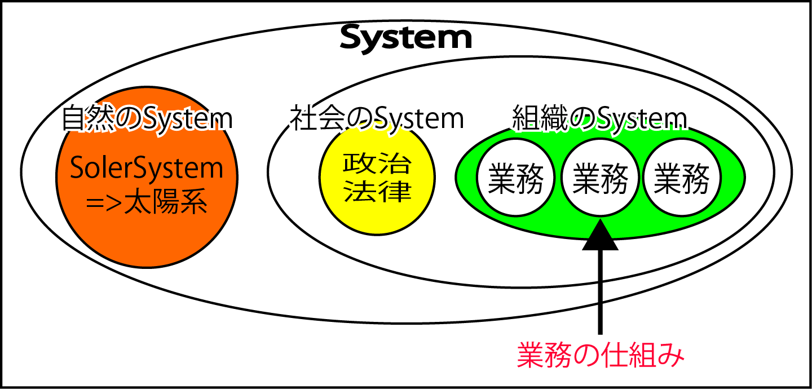

# 組織のシステム

* 特定の組織の`目的`を果たすためのシステム
    * 目的: 株式会社なら、特定の商品やサービスを市場に提供して一定の利益を上げながら存続し続けることetc
    * 会社では、「会社というシステム」を運用
* この仕組みを構成する「個々の要素」は、人が行う`業務`
    * さらに、交渉や伝達、計算、記録などの作業に分解できる

**個々の要素(業務)**が**互いに影響**しあって、**全体として会社の機能**を果たしてきた

* ITに置いては`システム = 業務の仕組み`

```text
開発をするコンピュータシステムは
複数のプログラムがコンピュータ、ネットワークなどと組み合わさって、
全体として特定の問題を解決する仕組み
```



