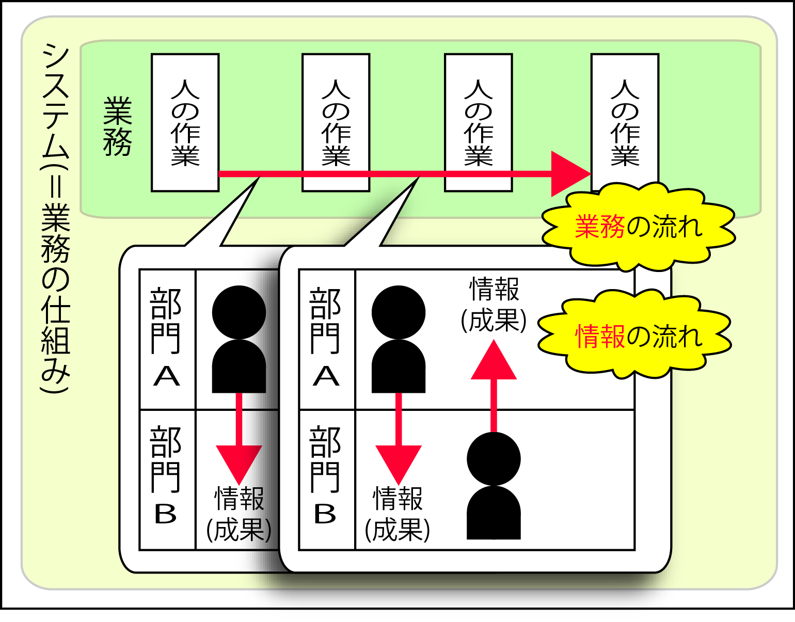

# システム

**個々の要素が互いに影響試合い、全体として１つの機能を果たすもの**

今回の場合**業務の仕組み**のこと

## 解説

* [自然システム](01)
* [人口システム](02)
* [組織のシステム](03)
    
## ◯◯システム

◯◯システムの、◯◯に入るものは『どこに着目するか』により呼び方は変わる

何を**認識**し、何を**整理**するか

# 物流と商流

## 概要

* 物流システムの専門家
    * 業務の仕組みを`物の流れで認識`し整理する
* 商流システムの専門家
    * 業務の仕組みを`金の流れで認識`し整理する

```text
情報システムは、業務の流れを「情報の流れ」で認識し、整理する
業務を連携させる媒介として「情報」に着目をする
```


