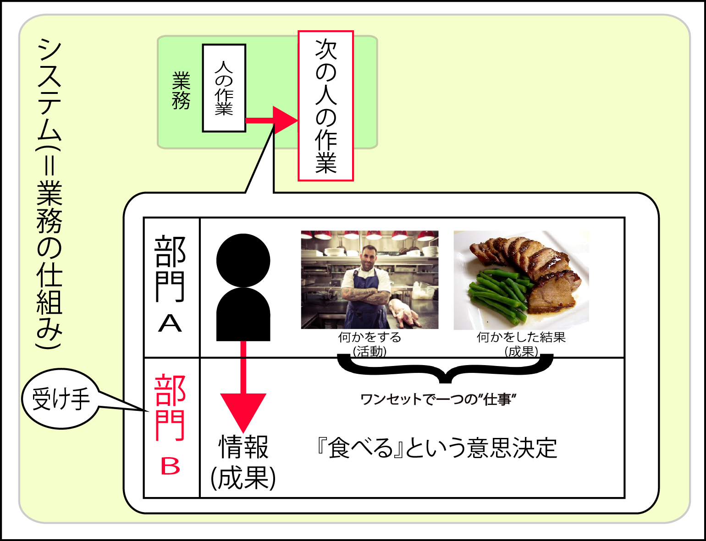
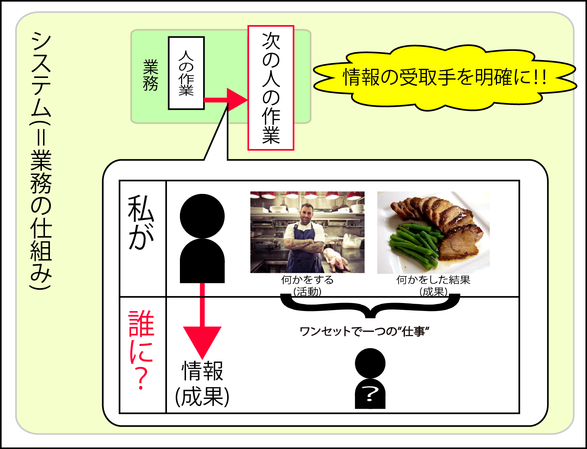

# 情報

情報とは**意思決定を促すもの**

* 概要
* 情報は正確であること
* 情報はタイミングが適切であること
* 情報の受けては組織や役割
* 情報を設計する

## 概要

* 受け手に何らかの意思決定あるいは行動を引き起こすもの
    * 例えば、携帯電話の画面に表示された株価の見て買いの注文を出した時、その人にとってその株価は「情報」
        * 表示がグラフかどうかよりも、株価そのもの、あるいは機能との差額の方が重要
        * 結局は買わないという意思決定をした場合も、情報として機能した(何もしないことを決定させた)ことになる



## 情報は正確であること

* 情報が情報として正しく機能するための第一次の条件
    * 例えば株価サイトの場合、カラーのグラフで見やすく表現されていても不正確なら無意味
        * A: 100回に１回くらいの確率で数値が間違っているかもしれないサイト
        * B: 白黒の表形式でちょっと見にくいけれど、常に完璧なデータが提供されるサイト
        * この場合はBに価値がある
            * 見た目や操作性よりも、まず「正確なデータ」で構成されているか
* その情報に基づいて意思決定する人にとって「正確さ」は情報の「生命線」であり、最低限の「必要条件」        


## 情報はタイミングが適切であること

* 同じ正確さなら、「タイミングの良い」情報の方が価値が高い
    * 「理想のタイミング」は、情報の提供者ではなく「受け手」に左右される
* 「正確なデータ」を手に入れるには時間がかかる
    * ユーザーの要望を正しく受け取ったとしても、「理想のタイミング」は必ずしも実現可能とは限らない
* 情報を設計する場面では、「正確さ」と「タイミング」がトレードオフの関係にあるの

```text
株価を左右する企業業績の発表が遅い会社と早い会社では、どちらが有利か
あるいは、いくら絶対に当たる正確な天気予報でも、目的の時刻の５分前にならないと発表されなかったらどうか
```
```text
株価情報を提供する立場であれば、出来るだけ新しいものが良いに決まっていると考えます。
しかし「受け手」である情報の利用者によっては、
例えば、朝から晩まで毎日チャートとにらみ合い、
秒単位で売買をしているデイトレーダーと、株価の大きな流れを判断して、
週に一回、日曜日の晩だけに注文を出す個人投資家とでは、この「理想のタイミング」が異なる

デイトレーダは、３分前の情報すら古くて使い物にならないと考え、
週一回のペースの個人投資家には、時何十時間も前の週末の終値で十分と考える
```


## 情報の受け手は組織や役割

* 情報とは、「`受け手に`何らかの意思決定あるいは行動を引き起こすもの」
    * よって、`受け手`をはっきりさせないと定義も設計もできない
* その人その人によって、必要とする情報に違いがある
* 情報の利用者を個人名ではなく、「組織」や「役割」の単位で捉える
    * 一人一人明らかにして、個人単位で対応することは現実的ではない
* この捉え方の具体性が、情報の価値＝情報システムの価値を決定する重大な`要素`になる
    * 個々の要素(`組織や役割`)が互いに影響しあって、全体として一つの機能を果たすもの



## 情報を設計する

* 「正確なデータ」を渡すためには、いつ？どんな情報を？誰に？を知ることが情報設計の第一歩。
    * 「理想のタイミング」を知ることが情報に対するニーズを理解すること
    * そして、両者の「バランスをとる」ことが、有効な情報設計をすること

```text
業務を理解して情報の受け手を想定し、
『受け手にとってちょうど良いタイミングで、最も正確なデータ』を明らかにして
『受け手に何らかの意思決定あるいは行動を引き起こす』ための筋道を組み立てる
```


* 小学校で保護者宛に配られる配布物も情報設計の結果

1. 教員は学校行事を理解し、保護者という受け手を想定し、
2. 行事の数週間前に通知を、正しい情報で提示し、
3. 行事に顔を出すという意思決定あるいは行動を引き起こすため
4. 『終わりの会』で生徒に手渡し、保護者に渡すよう伝達する
