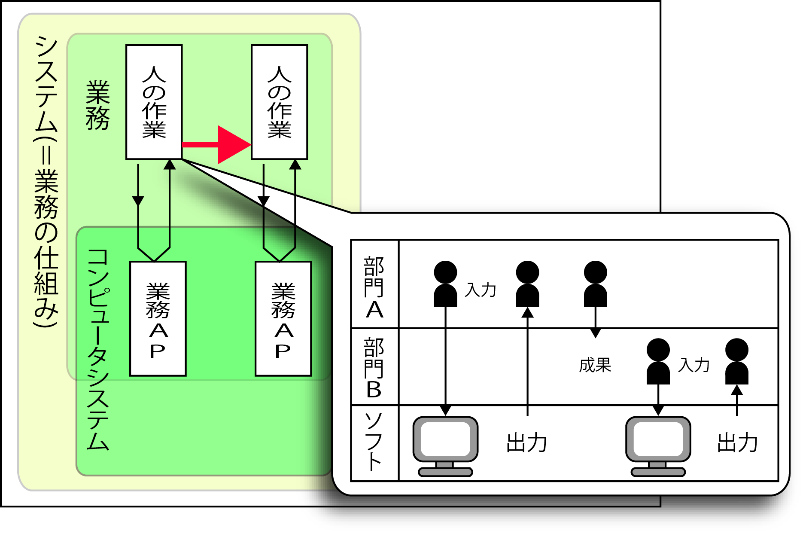

# 概要

## システム化とは

* システム化 ＝ `業務の仕組み化` = 業務の仕組みを作り上げること

## 範囲

* `企業経営の全ての範囲`を含む
    * コンピュータシステムは、業務の仕組みの一部にすぎない
    * 新しい業務の仕組みを考え、作り上げる活動

## 目的

* `事業の付加価値向上`

## 背景

* 経営層は常に新しいビジネスモデルヘの転換を模索している
    * システム化ヘの投資は、既存システムの保守・維持・改善のためだけではない

## ゴール

* 事業の付加価値を高めるための仕組み作りを支援する
    * 上流工程の実際の現場では、既存システムの改善や改修が目的となることがほとんど
        * その場合は、現在の仕組みの悪いところや不具合を探して手直しするという考え方でよい

## TODO

下記の調整を行う

* 外部設計などはユーザーの圧力と、開発側の圧力との調整
    * ユーザー: 機能追加への圧力
        * １つでも画面や機能が多ければ便利になる
    * 開発側: 当初の見積もりに抑えようとする圧力
        * 予算内に抑えたい

## 情報システムとIT

* 情報システムとはコンピュータシステムを含む業務の仕組みそのもの
    * 情報システム化にコンピュータの利用が含まれることはもちろん
    * `情報システム化 ＝ コンピュータの導入`ではない
* コンピュータを使わなくても、「情報を活用する業務の仕組み」が機能していれば、それは「情報システム」

