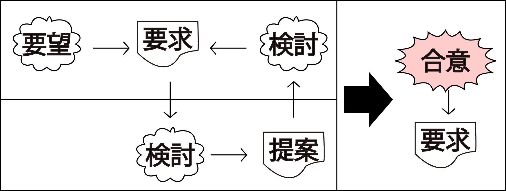

# 情報システム化の流れ

* 経営層が`経営戦略の策定`を行う
* 経営戦略の策定の結果を受け、業務改革の領域で`BPR`を行う
    * Business Process Reengineering / BPM (Business Process Management)
* IT活用領域でコンピュターシステムを構築
* 結果評価
    * 評価や効果で経営層は情報システム化に対する次の投資の意思決定
        * 評価: 企業に対する評価
        * 効果: 企業の業績向上など

## 合意形成までの基本的な流れ

* [要望を出す](01)
* [要望を要求にする](02)
* [要求を検討する](03)
* [代替案を考え、提案する](04)
* [合意形成をする](05)

## 情報システム化企画の材料

* Ph1.情報システム化企画の材料
    * 経営戦略の理解に基づく方向性や事業戦略

### ダメな企画

* 成果にばかり着目し、評価や効果に対する狙いが曖昧
    * 利用者側の評価を得た結果、どのような効果を狙っているのか？の問いに答えられない
