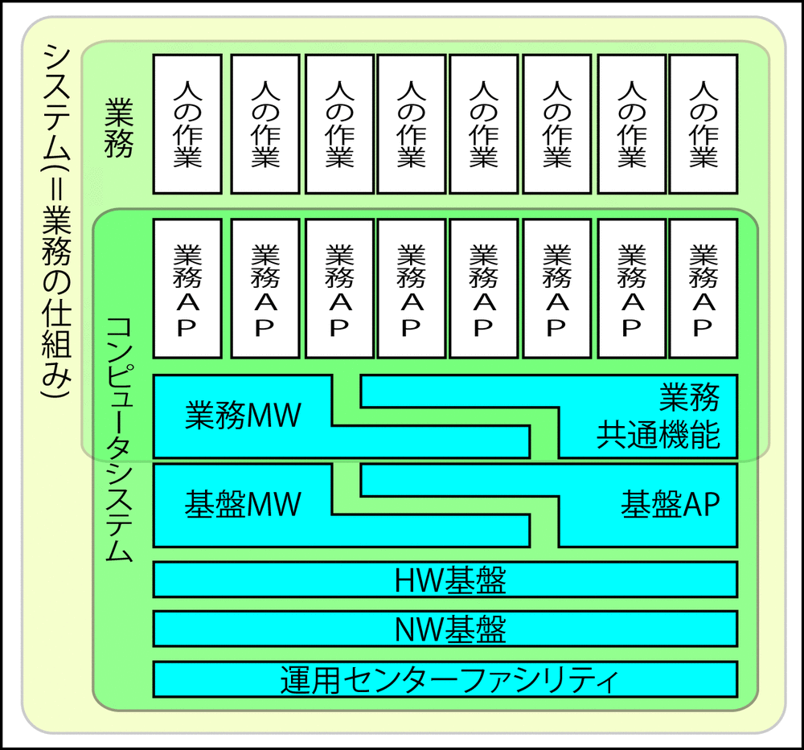

# 観点

**成果→評価→効果の、ストーリーが描けるものが良い企画**

```text
完成した在庫管理システムの場合、利用者が「仕事がやりやすくなった」
と評価をした先に、在庫回転率が向上するという効果が生じる。などのストーリー
```

* 新業務システム構築の企画段階において重要なのは、`効果`までのストーリー全体の一貫性
    * 個別の正確性よりも新しい業務の仕組みを設計し、実現し、実際に運用することで`業績を向上させること`という`効果`までのストーリー
        * 効果: その成果からどんな事業上の効果が出ているかを見ることで、ユーザーでも検証できなくてはならない
        * いくら個々に優れていても脈絡のない集まりでは決して良い効果は得られない
        * 成果そのものでは無く、その先にある本当のゴール設定がどれだけきちんとできているかが企画の良し悪しを決める
            * 誰の何に対して、どのような評価や効果を得られる成果を作るのか
        
## 企画は利用者便益の観点を重視する

* 狙い/企画を明確にする
    * 企画もなしにいきなりソフトウェアは作れない
* `利用者便益（ベネフィット）の観点`から精査する
* 成果/評価/効果の違いを明確にする
    * 成果 - アウトプットであり、作り手が生み出すもの
        * 目玉焼きの例でいうと、目玉焼きそのものは成果
    * 評価 - 受け入れる側(依頼側)が成果を評価したもの
        * 目玉焼きに対して「美味しい！」など
    * 効果 - 受け入れ側が得る効能
        * 「満足した」などの効果

## IT化されていない部分も視野に入れる

* `業務の仕組み全体`を見渡す視野を持つ
    * コンピュータシステムだけ、あるいはさらに特定の言語や環境に依存して狭められた範囲だけに閉じないこと



## 経営者視点を持つ

* システム開発の目的を把握する
    * ユーザー企業に対して広い視野をもつ
        * 会社全体の業務が最適になるようなシステム開発の目的を設定できているかを判断できる視点
        * 特定の業務部門の利害だけを優先してシステムを開発しようしていないかを判断できる視点
* ヒアリングやインタビューをするにあたり、経営者視点を持つ必要がある
    * 経営者: 取締役
    * 取締役かCIOにヒアリングする際、大きなIT投資やIT戦略の方向性を検討する
        * 大きな: システムのあるべき姿について
        * 目的は、細かい業務やシステムの仕様を聞くことではない
    * CIO: Chief Information Officer
    * Chief Information Officer
    * 企業のIT投資やIT戦略の最高責任者
    * CIOは取締役から選ばれることが多いため、CIOも経営者
* 取締役やCIOにヒアリングする最大の目的は、システム開発の確認する
* CIO以外の経営者は、ビジョンという目的と利益、すなわち結果だけに興味がある
* プロセスに対して直接の責任を持っているのは、それぞれの業務部門

## 業務とITの主従

ITを実現するために業務が存在することはない

* 業務とITの関係は、「業務が主でITが従」
    * ITは、業務の遂行を実現するための存在
* 業務の視点は、経営者の視点ではない
    * 経営者の視点に立つのであれば、利益に注目すべき
    * ITを使い、業務を作り変えてコストをカットできてこそ、経営者の視点
* 経営者から見れば、`業務も一手段に過ぎない`


