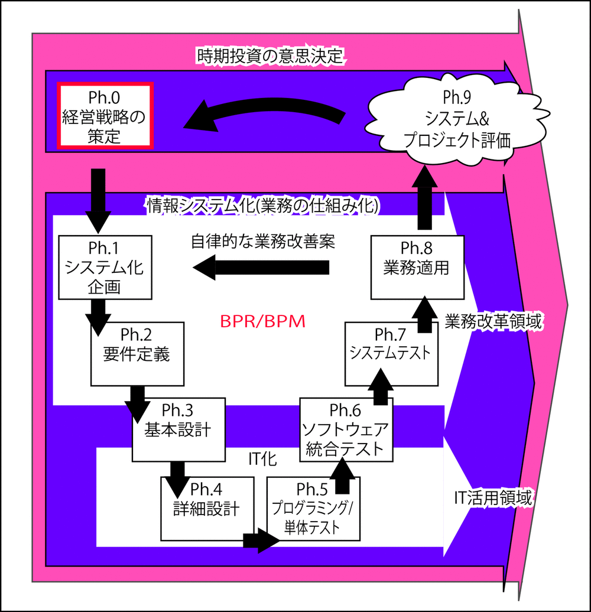

# 情報システム化とは

**情報**を使って**業務をシステム化**すること

現状から新システムへ移行するにあたり、何がどう変わるのかを明らかにする

## TODO

* 新ビジネスを実現方法の具体化

## 概要

* [情報システムとは](00)
* [概要](01)
* [目的](02)
* [情報システム化の流れ](03)
* [観点](04)

## 範囲

* ph.1, ph.2を遂行し、IT化の土台を準備
* 業務適用後の結果評価までを行う

