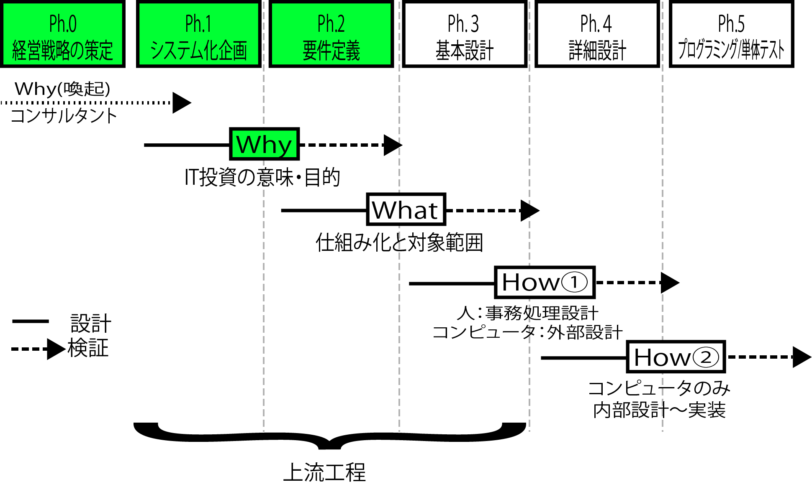

# Why：なぜシステムに投資するのか

* [要望のトップダウンとボトムアップ](top_bottom)
* 経営層はなぜシステムに投資するのかを聞く
    * 将来の夢や希望を教えてもらう
        * 想いを整理するための最初の着眼点
    * なぜシステム化投資を行うかの本当の意図(Why)を正しく理解する
    * その動機に沿った提案をする



## Whyの聞き出しのポイント

* 聞き出す時は予習は当たり前
* 謎解きをする
* 要望のステージの確認

ステージを確認することで提案のチャンスを掴む

```text
「今回は現行システムをWeb化するだけだから」
「ならばWeb化のチャンスに、競合他社で実施されているこの業務を支援する機能を取り込んでみませんか」
```

例：スポーツスクール

* 生徒のモチベーションを大きく分類
    1. 楽しみながらエクササイズがしたい
    2. 大会で活躍して実績を残したい
* `1`の生徒のモチベーションを上げ、`2`にする
    * 『特訓クラス』に移動する
    * 特訓クラスは時間当たりの料金が一般クラスに比べ高額だが、講師の人件費は変化しない
        * 利益率は上昇
        * 特訓クラスを受講することで得られる価値を示すことができれば保護者の投資の意欲も増す。

## 聞き出す時は予習は当たり前

* 初回訪間までにホームページや新聞、業界誌などで予習
    * Whyの答えを正しく理解するために役立つ
    * 共通の認譏などが業界ごとに異なる
        * 競合他社の戦略
        * 業界全体が注目している新技術
    * 同じ製造業でも、造船業界と食品メーカーでは旬の話題が違う
    * 個々の企業・組織の相談に乗るには、業界の旬の話題を事前に理解したうえで個別の話を伺う
        * 個別の話を伺う際は、その企業・組織名で新聞や雑誌を賑わせた話題は押さえておく

## 謎解きをする

* ユーザーの要望からは投資の意図わからない
    * 常にこの状態をスタートライン
    * はじめて相談に乗るユーザーは、このように自らの「熱い想い」だけで発言していると思ったほうが親切
    * 説明が苦手な結果、抽象的な言葉を使って切り詰め、できるだけ短く伝えようとしてくることがある
* 抽象的な短いー言に込められた想いを1つひとつ解きほぐして整理
* システム化によって何を実現するかがイメージできるようになると、その効果を見積ることができるようになる

## 要望のステージの確認

* 意図的にシステム化投資の意味のステージを高めるため
    * Whyを聞く、あるいは想定・提案・合意して決定することは、主に`Ph.1システム化企画`工程の主な論点
    * 経営層からより積極的な投資や協力の姿勢を引き出す
* 企業や組織がシステム化の案件に投資する理由を考えると、現在のステージ(モチベーション)が見える
* クライアントのモチベーションを上がるということは、サービス提供側は高付加価値を提供するチャンス
