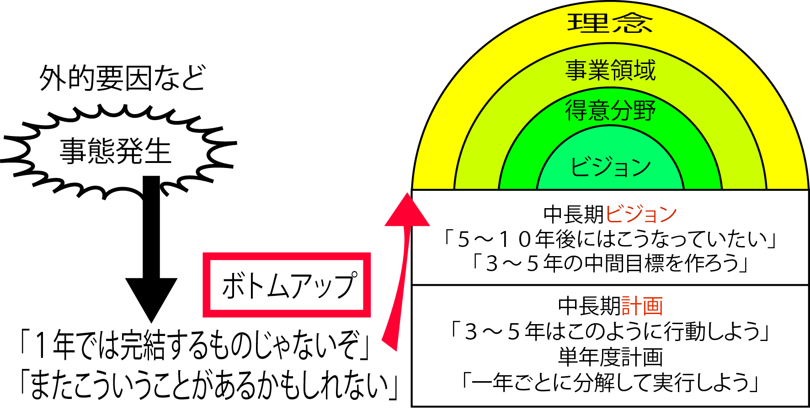

# ボトムアップ

* ボトムアップの具体的な要望を①～⑦の計画に組み込む
    * 例:PC端末の入れ替えなら単年度計画の範囲内だが、新0Sヘの切り替えが必要な場合には、中期計画の見直しも必要
        * 常に最新のものは入れずに何バージョンか上がった段階で対応するといった計画は、長期レベルでの決定事項
    * 業務面では、例えばキーマンの突然の退職による組織変更などもボトムアップ型の検討対象
        * 競合他社の事業撤退による突然の合併対応などのこれらは、必ずしも前向きなきっかけで起きることではない
        * 影響の度合いによっては、中期(3年)あるいは長期(5年以上)の計画に組み入れ直し、整合性を再確認する必要がある

