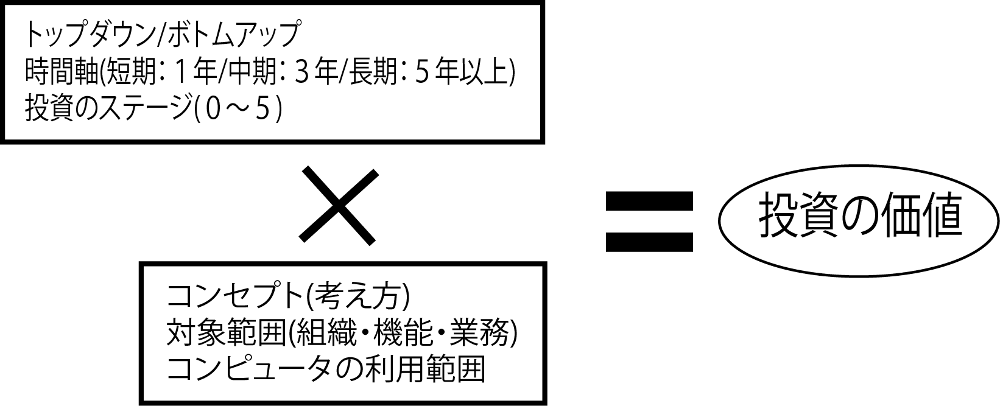

# 要望のトップダウンとボトムアップ

要望の元となる夢や希望はトップダウン型発想/ボトムアップ型発想で分類可能

* [トップダウン](01_topdown)
* [ボトムアップ](02_bottomup)

## 中間的な時間の理解

* [要望の上下を判断する](01)
* [最低限できればよいことを知る](02)
* [複数の案で予算の上限と下限を探る](03)

### ボトムアップもチャンスと捉える

* 極力プラス面を付加する
    * 提案の姿勢を持ちながら聞く
    * 案件のステージを上げる活動は、この段階から始まる
    
### 上限と下限の接点が投資チャンス

* ボトムアップ的な要素とトップダウン的な要素がちょうど良いタイミングで重なったときがシステム化投資のチャンス
    * 情報化投資のステージの下限と上限を認識しておく必要がある
    * トップダウン及びボトムアップによる、いくつかのニーズの実現が複合的に望める

#### 次の3つの軸で漏れのないことを確認ながらヒアリング

* トップダウン型/ボトムアップ型
* 長期(5～10年)/中期(3年以内)/短期(1年以内)
* 投資目的のステージ(0～5/上限と下限)

