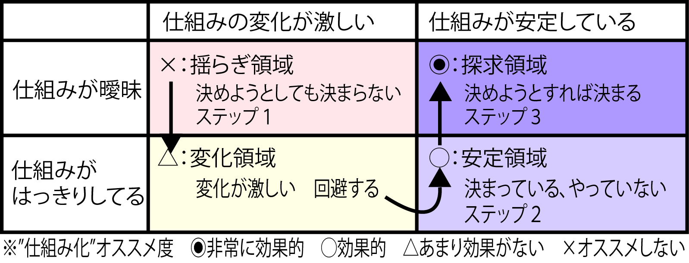
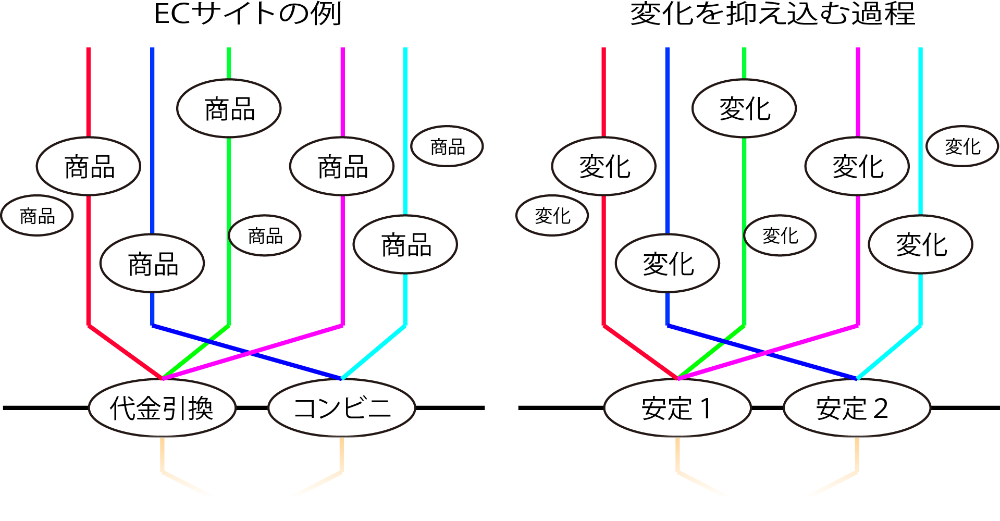

# 第1段階: 仕組み化するかどうか

* 上流工程では、仕組みが暖味な業務や変化が激しい業務を「仕組み化」することにチャレンジする
    * コンピュータ化するかどうか以前に、対象の業務を「仕組み化」することに注力する必要がある
* １段階目の「仕組み化するかどうか」でいう「仕組み化」とは
    * 業務のルールと手順をはっきりきせること
        * 再現、引継ぎなどが可能なように`定義と説明`を行う作業
            * `定義と説明`: ルール化・手順化・見える化
    * 業務そのものを現在とは違うかたちに組み立て直すことも多く、これを簡単に言えば`BPR`、すなわち業務設計そのもの
* 要件定義の終了段階では、今回の対象範囲を明確にしなければならない

## 判定する基準

* 以下のAとBの組み合わせ
    * A: `仕組みが暖味か/はっきりしているか`
    * B: `仕組みの変化が激しいか/安定しているか`
* ビジネス環境の変化により、同ーの業務が4つのセルの中を絶えず動き回る

## 手順

* 仕組み化の対象となりそうな業務をとらえる
* x→△→○→◎の順に効果の高いシステム化案に追い込んでいく
    * `◎`の領域を現在は暖味だが安定化させることができる領域であると意譏
        * 変化を起こし、非常に効果的なシステム化を行うことができるようになる
    * 探求領域: チャンスに変化を起こそうとしない固定的なとらえ方(御用聞き型の発想)による解釈
        * ただしこの場合も、暖味な点をとらえ、はっきりさせることで、安定化した業務を仕組み化する(x→△→○→◎の順で進む)

## ステツプ2：「△：変化領域」から「○：安定領域」へ

