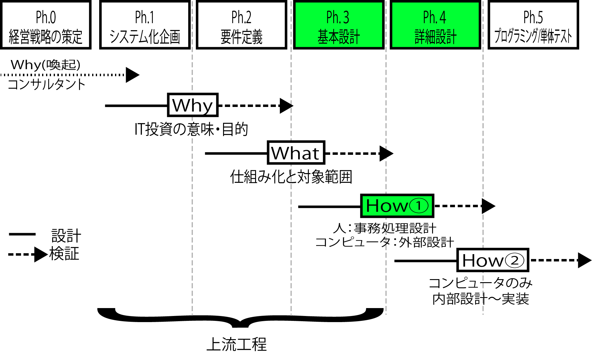

# How：どうシステム化するのか

* 仕組みの`実現方法`を検討すること
    * 人が行う事務の手続きの方法と、コンピュータに実装する機能の両方を含めて考える
        * 人が行う事務の手続きは、`仕組み化`の段階である程度`ルール化・手順化・見える化`されている
* Howを考える段階では、手順を1つひとつ明らかにする
    * 詳細度の目標は、エンドユーザーが実際の事務を行うためのマニュアルがすぐに書けるレベルの事務手続規定を用意
            * 個人情報管理であれば、個人情報が記載された原票や帳票の保管場所や施錠確認の手続きまでを明らかにする
    * コンピュータに実装する機能に関しては、一般に`外部設計`といわれるレベルの機能までを明らかにする
        * ユーザーがどんな操作を行い、それに対してコンピュータはどんな結果を返すのかを明らかにする
* UMLを使ったドキュメンテーションにおける個々のユースケースの定義は、ここで明らかにするコンピュータのHowそのもの



## UIを明確化するまでに留める

* 人の手続きも決めるため、実装技術を意識する必要が出てくる
    * 操作を明らかにしなければ人の手続きが決められないため
        * ホストなのか、クライアント/サーバーなのか、Webなのか？
        * 画面上で`戻る`ボタンを押したときの動作や、出力指定した帳票の出力先は？
        * あるいはハンディターミナルや携帯電話などの周辺デバイスの活用方法は？
        * 電子データの連携方式は？
* ただしHow①の段階では、主にユーザーインターフェイスを明確化するまでに留める
    * コンピュータの内部の処理の分割・統合方法や、場合別に設定された業務ルールの実装方法は、実装の専門事項であり、ユーザーの興味事項ではない
        * 実装方法: if文でネストするのか、判断モジュールを呼ぶのかなどetc,,

```text
例えばこれは、家を建てるときにコンセントの位置は指定するけれど、壁のなかのどこに配線を通すのかは工務店に任せるのと同じ
工務店側は、耐震や光熱費節減の`方式`について建て主と合意した後は、この方式を家全体にわたって適用するだけ。
ちょうど、インフラ方式、セキュリテイ標準、開発環境の標準、画面遷移の標準などの`方式類`を定め、これに従って詳細設計や内部設計を行うのと同じ。
```
