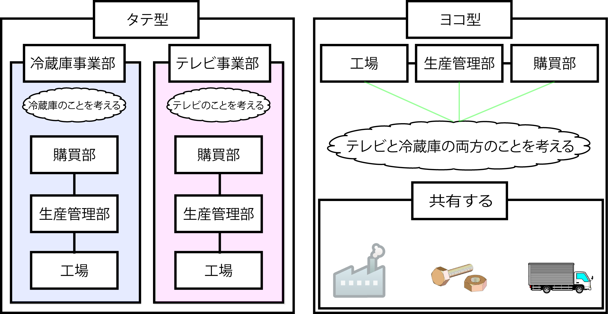

# 定常組織

組織は組織を活性化させるため、年度により定期的にタテ・ヨコを組み替える(業務の仕組みも大幅に組み替えられる)

## 特徴

* 組織構造の定期的な組み替えがある
    * タテ型・ヨコ型
        * それぞれの長所/短所があり、経営層はこれを定期的に組み替えて、組織の活性を保つ

## 概要

* タテ型/ヨコ型
    * タテ型
        * 事業部制を採用
            * それぞれが独立した別の組織
        * 事業部長も２人になり、それぞれの業績に応じて評価される仕組み
        * 従業員の人件費もどちらにかかったのかがはっきりする方法で管理され、別精算
    * ヨコ型
        * 機能ごとに責任を果たす

### 例 (工場)

* タテ型の例
    * 「冷蔵庫事業」
        * 「冷蔵庫事業部・購買部」「冷蔵庫事業部・生産管理部」「冷蔵庫事業部・工場」のようにタテ型にまとまった組織構造
* ヨコ型の例
    * 工場は１箇所
    * 細かい電子部品などは共通で使い、出来上がった製品を家電量販店などに届けるトラックも共有している
    * 購買部長や生産管理部長が、冷蔵庫のこともテレビのことも考える
    * 機能別

以上のように定常組織では、タテ型・ヨコ型の両方に対応可能に意識する

