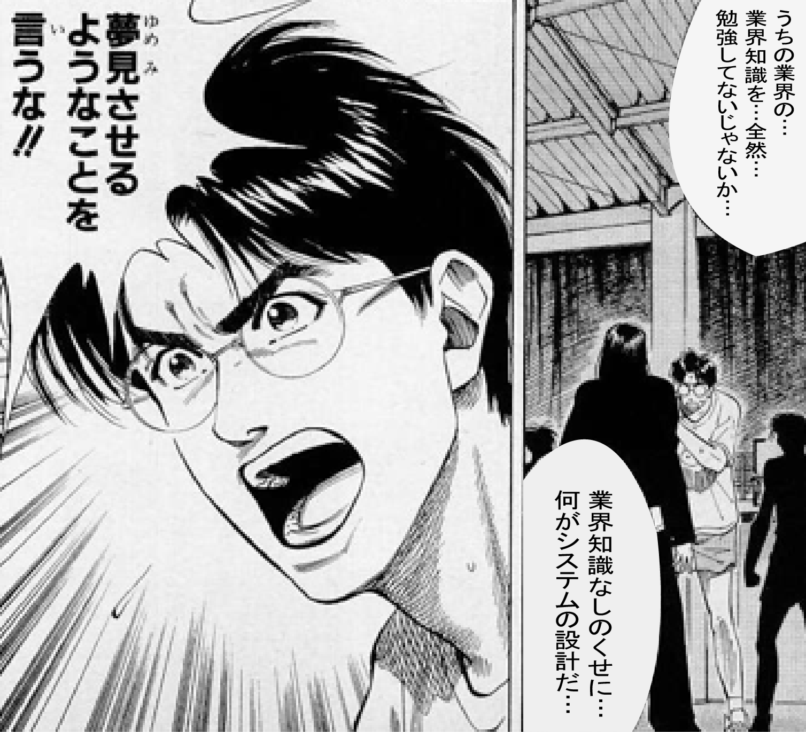

# フォーマルな組織とインフォーマルな組織

* 組織のフォーマルな面とインフォーマルな面の両方を意識する
    * フォーマル: 責任者
    * インフォーマル: キーマン
* どんな組織にも、組織構造上の責任者やリーダーが規定されている
    * 実際の現場には`部長が頼りにしている担当者`タイプの方がいる
        * 出世したり責任をとったりすることに興味はない
        * 実務的な経験が深く感も鋭いといったタイプ
* 意識して探せば必ずいる
    * 意識しないと見つからない

* 必ず、組織のインフォーマルな面にも着目
    * 「キーマン」にも早々に気持ちよく納得してもらう必要がある
    * 責任者だけでなく、キーマンの支援も得て進めるプロジェクトは、あらゆる場面でスムーズに進捗する
* もし、フォーマルな組織構造上の「責任者」や「役職者」の承認が容易に得られても、不十分
    * キーマンの支援を得ていないと思わぬタイミングで「ひっくり返される」ことがある
* キーマンへの事前のアクセスは「どうせ必要なことを効率的に行う」ための近道

