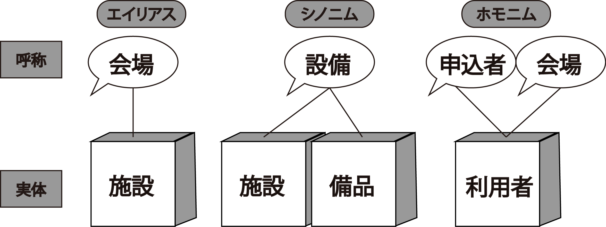

### 特殊用語を抑える

* システムの世界では、`３文字略語`の類が横行
* 以下の意味を明確に定義
    * 業界用語やIT用語
    * 難解な業界用語
    * その企業独自の用語
    * 組織内だけで通用する用語
* 理解しておかないと開発チームのメンバーが理解できない

1. 一回は質問をする
    * 初回ミーティングの間に必ず１回はどれかをさして質問
2. 特殊用語の質問は恐れない
    * `わからないことは聞く`という雰囲気を自ら作る
        * 初回は相手も緊張
        * お互いにできる奴と思われたいという心理も働いている
    * `そんなこともわからないで話を聞いていたのか`という顔をされてもいい
3. 聞きやすいパターンを作る
    * 挨拶の段階では、「聞く姿勢」を伝え、`聞きやすい場づくり`を完了させる
    * `わからないことは聞く`パターンに乗ればいつでも、何でも聞けるようになる
        * それは早ければ早いほど知識量が増す
        * 効率的
            * ついでに様々な経緯やコンセプトが聞けるかもしれない
                * そのコンセプトがどの程度実現できていて、問題は何のなか
                * 前回構築した時と今回の環境の差は何で、課題は何かetc,,
4. 用語集を作る
    * その普段使っている名前を概念につける
        * 後の概念モデリングで、様々な概念や属性が登場した際に役立つ
        * 概念や属性には名前が付いている
    * 業務担当者によって同じ用語を違う意味で使っている可能性もある
        * このような問題を回避するために用語集を作成
            * 用語集の対象は、概念モデルに登場する概念と属性
5. 項目の名称を視野に入れた用語確認
    * ディテールを詰めるという段階では`項目の名称`について意識
    * 開発トラブルの要因の1つに、項目名の`エイリアス`、`シノニム`、`ホモニム`がある
        * エイリアス ＝ 別名
        * シノニム ＝ 同音異義語
            * 同じものに対して2つ以上の異なる呼び名が存在する場合
        * ホモニム ＝ 同音異義語
            * 1つの呼び名が場合によって異なるものを指し示す
                * 例えば、『アーキテクチャ』などはフェーズによって意味が変わる
    * これらはいずれも概念データモデル作成時に混乱の元となる
    * 入力された内容がデータベースの別の項目のところに記録されたりということになりかねない
    * できるだけエイリアス、シノニム、ホモニム、を排除する

