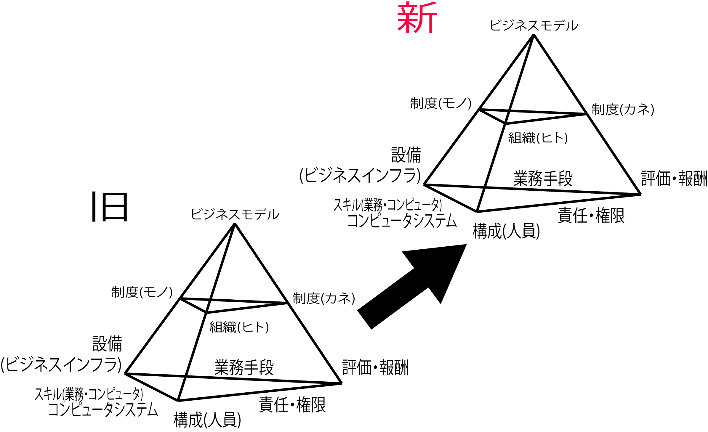

# インタビューの目的

仮説の実現可能性をインタビューによって検証

## TODO

* レベル1について調査
    * ヒト/モノ/カネ
* レベル２の各要素について検討
* 現状と新業務システムの間で何がどう変わるのかを一つ一つ明示

現状と新業務システムの間でモノ・サービスの提供の仕方がどう変わるのかという点を考える
    

## 必要な業務知識

* 要件定義や外部設計をする際に必要なもの
    * 業界に関する業務知識 - 業務知識とは、特定の分野の業務を行うために必要な知識のこと
    * その会社ごとの業務知識 - 会社ごとのルール

## 目的

現場に入って調査を行う目的は、検証するため
    * 現状調査ではない
    * 事前に立てた仮説のイメージがどこまでスムーズに実現可能なのか
    * 制約事項や非現実なアイデアによって机上の空論になっていないか

## インタビューのゴール

* 仮説の提示とイメージの共有
* 現在の実力に見合った実施可能な当面のゴール設定
* 決裁者を明らかにする

#### 設計とは図面を書くこと

* `コンセプト、対象範囲、コンピュータの利用範囲`の組み合わせで、いくつかの案を示す
    * 考え方や効果を示す設計図を作成する
        * 例: 在庫管理のコンセプト(考え方)を｢目検＋手発注」から「安全在庫設定＋入出庫のデータ化＋自動発注」に変える
        1. これはまず、現在の在庫推移グラフと、新しい計算方式に基づく在庫推移シミュレーション結果のグラフと並べ、その効果を示す
        2. 入出庫データを把握する仕組みと、その運用に当たっての業務の負荷を示す
        3. 全品目を対象にした場合、特定の品目だけに限定した場合などの複数のイメージを用意して聞き取りを行う
* 実物を作ってしまう前に`見える化`することで、設計の段階でよいものに創り変えていく
    * 設計のどんな段階にあっても、その段階に適した形でアイデアを示す方法を身につける必要がある
* ユーザーに聞いたことを書くのではない
    * 自分のアイデアを先に下書きとして示し、ユーザーに筆を入れてもらうために意見を聞き取るのがインタビュー
* `常に提案型`のインタビューが行えるようになるには複数の下絵を用意する
    * 最もイメージに近い絵を選んでその詳細を修正する