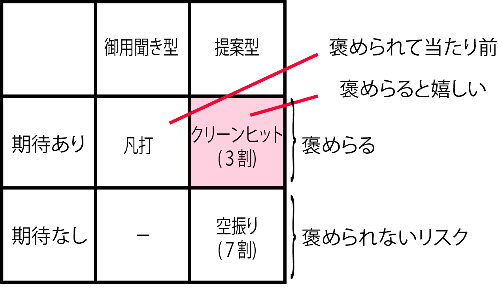

# 仮説検証型アプローチ

常に仮の答え(＝仮説)を先行させる

* 仮説を用いて仮の解消
    * 正しい答えを示すデータがない場合
* 課題を明らかにする
    * イメージを具体化し、質・量・時間の適切な目標を設計・検証・調整
    * そのゴールにたどり着くための道筋と重要な事柄を明らかにする

その結果洗い出された「重要な事柄」こそが「課題」

* 正しい答えを示すデータがない場合に使用する
    * ｢『もし仮に』AをBにしたら、CがDになる『はず』だ」と発想
        * この仮説が事実の裏付けによって検証されれば、｢AをBにすることで、CをDにすることができる」という検証済みのロジックになる

```text
｢今まで、麦茶や緑茶を有料で販売して売れたという実績データはどこにもない
しかし、『もし仮に』飲み終わった後に口がべたつかない無糖茶系飲料を飲みたい人がいるとしたら、暑い日のど麦茶や緑茶が売れる『はず』だ」。
こう発想した社員が、データの裏付けなどない商品を店頭に並べたところ、これが大ヒット。
これを仮説とした試験販売が行われ、この｢仮説｣は事実に基づいて｢検証」された。
今では、不快指数が高くなると無糖茶系飲料が売れるというのは常識になった
```

## ◯: 仮説検証型

* インタビューを受けた方も常に我々の目指したイメージを理解したうえで回答する
* そうすると結果的に、アイデアの何割かはユーザーさんの発案によるものになる
* 初期案を提示することでギブアンドテイクの関係が生まれる
* ともに実現を目指す協力者として仕事を進めることができるようになる

### 空振りのパターン

【仮説検証型のインタビュー1】

```text
* (複数の点において)現状のこの点はこう変えられませんか
* (ダメならば)実はこういう業務を想定していたのですが、どこが悪かったのでしょう
* (複数の点について)経緯・背景・制約はわかりました
* これらを前提に、また新しい案をお持ちしますので、ご協力をお願いします
```

そして、次のチャンスで、以下、以下のように提案する

### クリーンヒットのパターン

【仮説検証型インタビューその2】

```text
* (改善した案に関して)現状のこの点はこう変えられませんか
* (良ければ)だとすると、今後はこういう業務の流れになり、こういう効果が出ます
* もし本当に実行したとして、失敗しそうな点や残る課題はなんでしょう
* では、こんな対策をとりますが、ご協力いただけるでしょうか
* ありがとうございます、ご期待ください!
```

