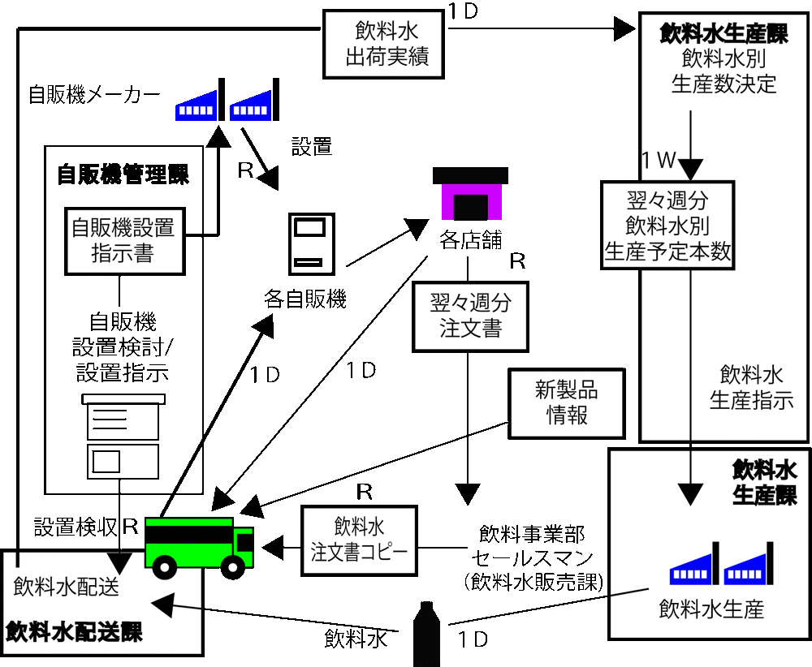

# 結果を「新業務イメージ図」にまとめる

実現可能性があることを得たら`新業務イメージ図`にまとめる

* 新業務イメージ図は説明用資料
    * 正式な図面としての位置付けだけではない
    * 図面ではなく説明資料
* 建設の分野におけるパース図に当たる一般利用者向けプレゼンテーション資料

## 事前準備

* 新業務イメージ図の記述対象項目をチェック
* どの点がどんな変化を起こすのかを必ずチェックして明示
    * 後続工程での手戻りや追加要件を防止する

## 記述のポイント

* フリーフォーマットのイラスト形式による新ビジネスモデルの表記方法
    * 必要に応じて記述要素に強弱をつけて選択することが可能
    * 新業務イメージ図には「人」や「トラック」「建物」などの絵も描かれる
* 必要な表記要素は「ビジネスモデルの構成要素」そのもの
* 現状との相違点を重要視して表現
    * 新しいビジネスモデルをイメージさせる特徴的な部分に重きを置いて表現する
    * 特徴となるポイントのみを端的に表現
* ハードウェア構成図やネットワーク構成図ではない
    * 人や業務、制度などの影響を受けないことはありえない
* 構成要素の何を実現すべきかを意識して作図する
    * 漏れなく効果的に描く

## 対比ができない場合

* 全く新しいビジネスモデルを表現する場合は
    * `日経ビジネス`や`日経情報ストラテジー`などの雑誌のイラストを参考にする

