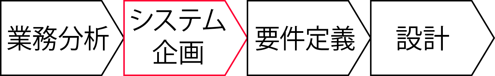

# インタビュー

* [概要](00_about)
* [ポイント](01_point)
* [アプローチ](02_approach)
* [イメージ図の作成](03_draw)
    * インタビューで得た方向性に沿って新業務のイメージを具体化

## 前提条件

要望のインタビューの下絵が用意されていること

### ルールは常識のみに収まらない

* 担当する会社が他の業界や会社ではまったく違うことがよくある
* 例: 原価計算方法や管理会計などは、会社ごとに違う

#### インタビューについての誤解

* インタビューの目的は、現状を聞くことではない
* 現状をよりよくした新しい仕組みについて意見を伺うこと
* インタビューの結果は設計図になる
    * 考え方や効果を示す文書

### 効果をあげたロジックを蓄積する

* 効果を挙げたロジックをできるだけたくさん抽出し、蓄積しておく
    * あるユーザーでうまくいったことが、全く違う業種には適用したことのないロジックを当てはめて考える
        * 他社での事例がそのユーザーにとって｢仮説｣になる
* 仮説を実現するための方法をイメージすると、必要なコストや解決すべき課題が想定できる

## 要求の整理

* インタビューの前には、事前に入手した情報とこれまでの経験から「きっとこうに違いない」と思える仮説(仮の答え)を必ず準備
* このような要求の分析や目標設定などが本質的に企画工程の課題
* インタビュー後に要求の整理をしておかないと、まず間違いなくピンチに陥る
    * 実はこういうことを実現してほしかった・実現すべきだった、というような話が持ち上がってちゃぶ台返しを食らうような状態になりかねない
