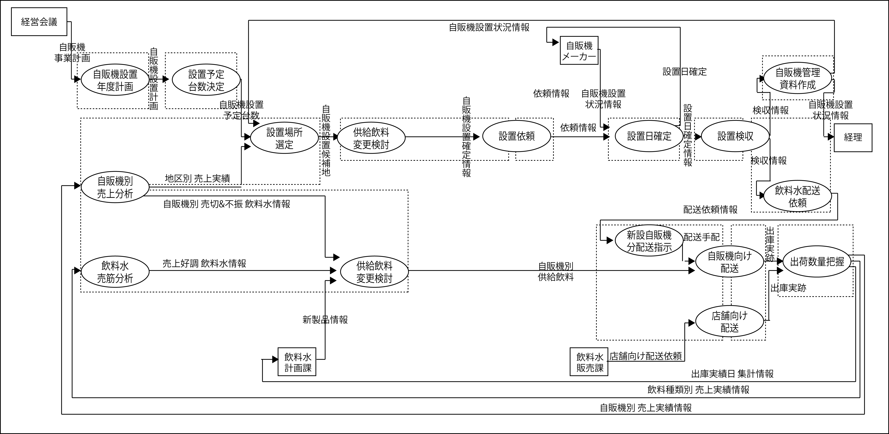

# 三面図の作成

* システムは複数の視点でモデル化し、間違いのないように図面で確認しながら設計を進める考え方が必要
* システムの三面図の要素のうち、プロセスに焦点を当てる

* 三面図の要素
    * 組織
    * データ
    * `プロセス`

## 前提条件

新業務のイメージが描けていること

## 概要

業務の仕組み全体をシステムとしてとらえ、これを`図面`で表現する

### 図面とは

* 作ってみる前にそれでいいかどうかを評価するための設計成果物

