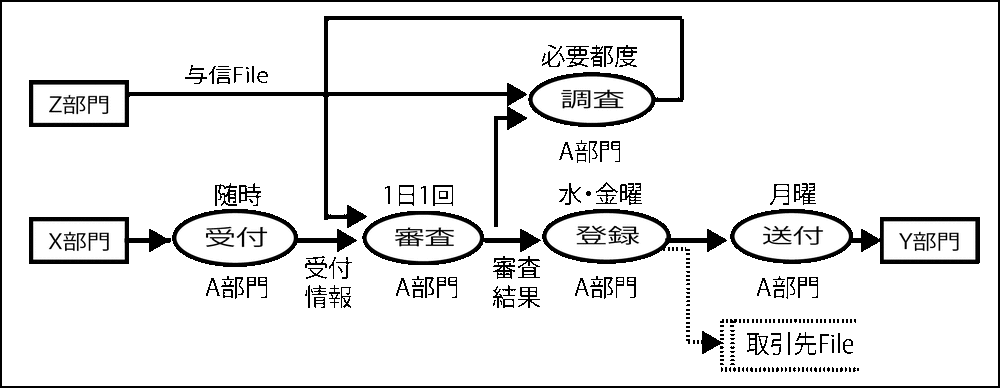

# 組織と機能を混同しない

* 組織と機能を混同してしまいがち
    * 係名や担当名を業務機能のシンボルに書き込んでしまう
    * その係や担当者が担当する複数の業務機能を代表するシンボルにしてしまう
    * 勘違いの原因
        * 外部エンティティとして組織名(『〜部門』など行為の主体)を書くことが多いため
* 本来は、その組織が担当する業務機能を書けば良い
    * 実務上、組織名だけで簡略表記する場合が多い
* 荒くても細かくても機能は機能として設定する
    * そこに機能名称を与える
    * 組織は、その機能の属性として補記する
    
## 組織と業務機能は別物

* 混同して記述するとその組織や担当者が担当する業務機能がそこに集中してしまう
    * 結果として図面が混乱する

## 実行責任を持つ組織や担当名も表記

