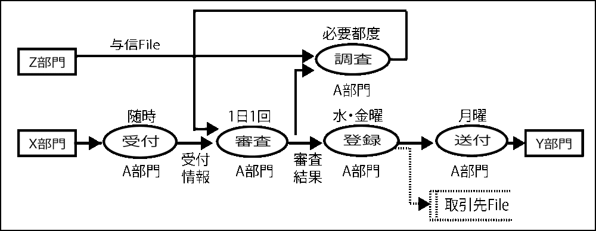
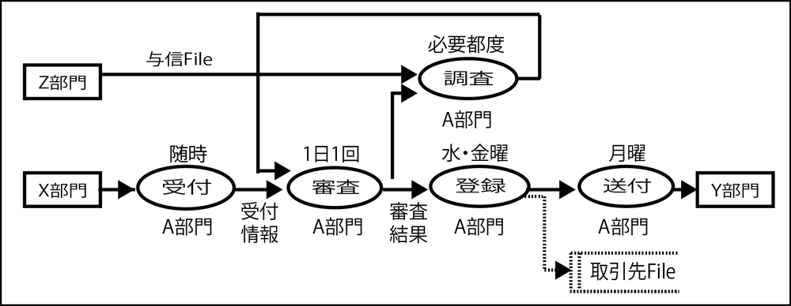

# ストアは書かない(プロセスとデータは分離する)

* 情報を生成する業務機能とその情報を要求する業務機能の間に矢印を表記
    * 対して、DFDでは、ストアと称してデータの滞留を表記していた
    * しかし実際は、時間的な滞留とコンピュータファイルによる保管が混同されてしまう
        * 表記が猥雑になる
    * プロセス/データ分離が常識になった時点で、DFDからストア表記は不要になった
    * ストアを書くことは、プロセス/データ分離型のDOAアプローチの発想が登場する以前の表記法である事を象徴的に表している
* 矢印の上には区別なく記述して良い
    * 上流工程では実装手段によらず、組織・機能間の情報の教受を表記して業務の流れ全体を設計するため
    * 人が手で受け渡す重要書類も、サーバー間で連携されるデータもなんでも描いて良い
* 機能間のタイミングのズレを表現するには、業務機能の`属性として実行タイミングを表記`すれば事足りる
    * そこに情報の教受がある事をシンプルに表現する
    
## タイミングの記述

タイムラグは、業務機能の属性として実行タイミングを表記することで表現可能

## ストアを非表記にする例

* Z部門からは「与信情報」を得て、調査業務が実施されることも明らかになった
* 取引先Fileは登録業務で表記は不要
    * 生成されるデータとして図として表記しないで良い
    * 点線での表記 = 本来記述しないという意味

