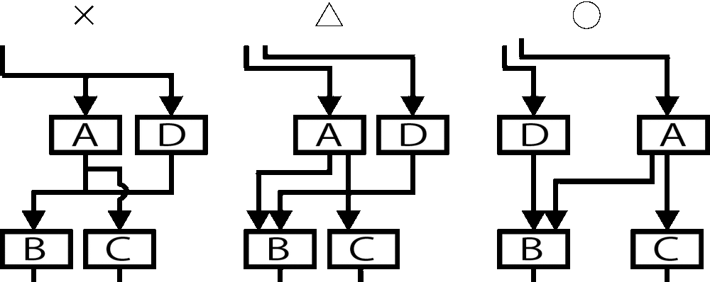

# 合流・分岐はしない

* 合流と分岐を無くす

## 例

* Aという業務機能から、BとCの業務機能にそれぞれの情報を渡す場合
    * Aからは１本の矢印が出て、別途で分岐してBとCに入るという矢印を書く人がほとんど
        * これはNG
    * Aから２本出す
        * いくら遠いところにあっても、いくら同じところをずっと通ることになっても
    * 業務機能関連図は図面
        * 指でなぞっていけば意味はわかること
        * 直感的に理解できること
        * 異なった行き先に異なった情報が渡されるなら、それが直感的に理解できることが正しい表記

## 飛越マークNG

* 合流と分岐がなければそもそも不要
    * 発生源から複数本で線を引くと線と線が交わっていても、合流でも分岐でもないことは明らか
* 合流と分岐をなくすことで飛越マークが必要なくなったら、配置を見直して整理する

