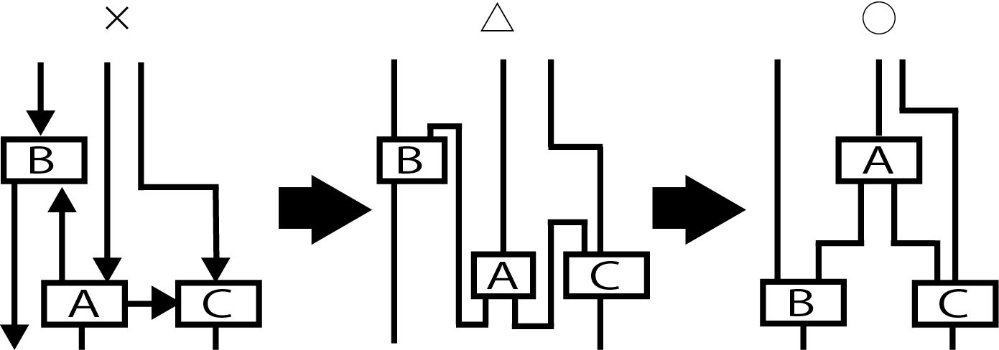

# 左(上)からin、右(下)からout

* inとoutの`接合点の位置`
    * in: 左(もしくは上)にたけ描く
    * out: 右(もしくは下)にだけ描く

# 例

* 下への↓、上への↑、右への→の３本が繋がっている
* 業務機能を表すシンボルの４辺を、流れの方向に沿ってin専用、out専用の接合ポイントをつなぐ辺に決める
    * 図の「△」のように、絵が少し複雑になる
    * しかしここで「×」の図に戻さない
* 配置を見直してAの位置を高くし整理
* in・out用の辺を決めるルールを適用すると、「×」の絵が「◯」の図面に仕上げられる

