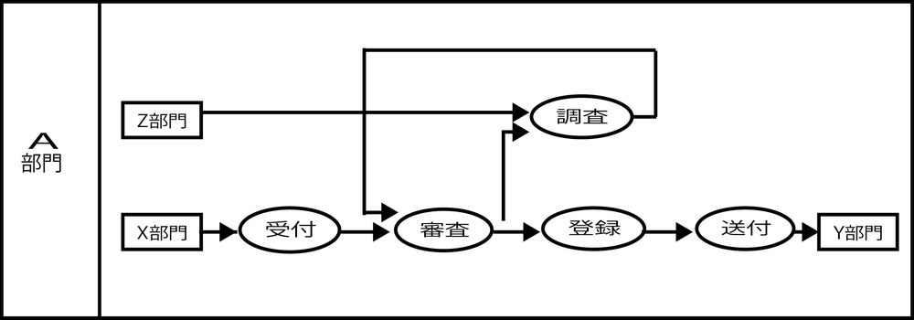
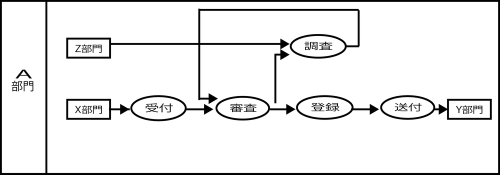

# レーン分けは行わない

* 業務機能の物理的な属性である担当組織(実装先)を配置ルールに含まないこと
    * 物理属性の変化によって論理的には何の変化もない機能の配置図が変わってしまう

* 実行組織ごとに仕切るレーンの分割を行わない
    * 業務機能関連図の作図では一般的な業務フローとは異なる
    * 正しい形のビジネスモデルの検討を促すことを目的とするため
    * それを論理モデルとして完成させることを目的とするため
        * 上流工程ではまず、正しい論理モデルを完成させる
        * 目的は絵や図を描くことではなく、頭の中に新しいビジネスの骨格を叩き込む
        * この考え方に基づいて、「Ph.1:システム化企画」では業務の仕組み全体の設計は論理設計までで一度線引きをすることを主な目的とする

### 例

* A部門は現在Z部門、X部門の業務機能を担当している

### 移管する

* これの一部をB部門の担当に移管する
    * 「受付」と「送付」を「B部門」に移管
    * 受付と送付という業務機能の構成は変わらない
    * 論理的に影響のない物理を足すことで制約だけが増えてしまう
    

