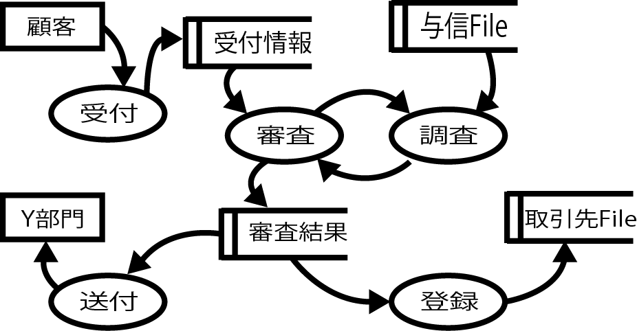
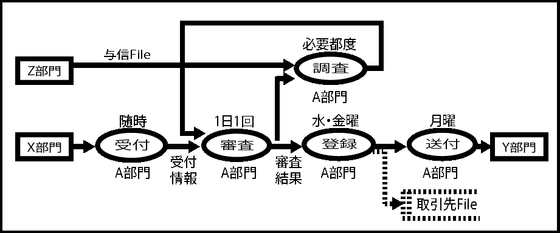

# 記述ルール

* [方向性を持たせる](01)
* [一枚の絵で描く(多階層化しない)](02)
* [方向性を明確に(左から右 or 上から下)](03)
* [業務機能の粒度を揃える](04)
* [組織と機能を混同しない](05)
* [ストアは書かない(プロセスとデータは分離する)](06)
* [合流・分岐はしない](07)
* [左(上)からin、右(下)からout](08)
* [レーン分けは行わない](09)

## ルール適用前

一般的なDFDの事例

## ルール適用後

* 従来のDFDを図面としての品質表現力を高めた現代の描き方
    * ストアを表記しない
        * シンボルが少なく済む
    * 矢印そのものが情報
        * ストアで表記は不要

