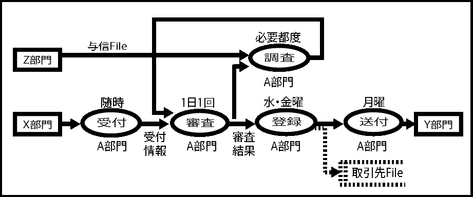
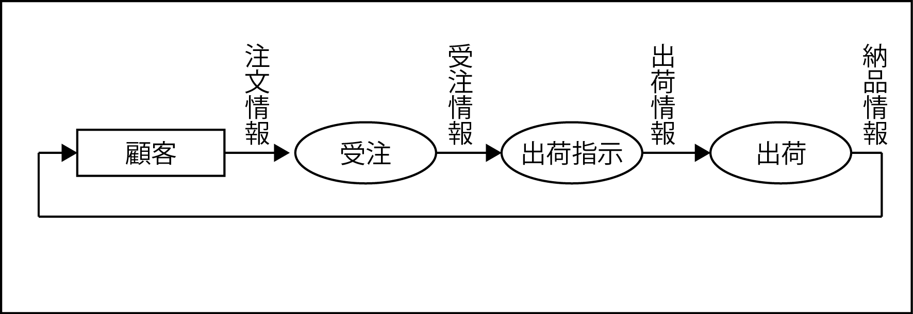

# 論理プロセスモデル

現状業務を分析し、業務機能関連図のかたちで論理モデル化する

* [概要](00_about)
* [記述ルール](01_rules)
    

* 何段階かの論理的機能を一連の処理で一度に実行する場合
    * 顧客から注文情報を入手(インプット)し、受注を行うことで受注情報が生成される
    * 出荷指示を行い出荷情報が作られると、これをもとに出荷が行われる
    * 出荷結果は納品情報として顧客に伝えられる

