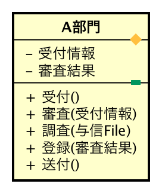
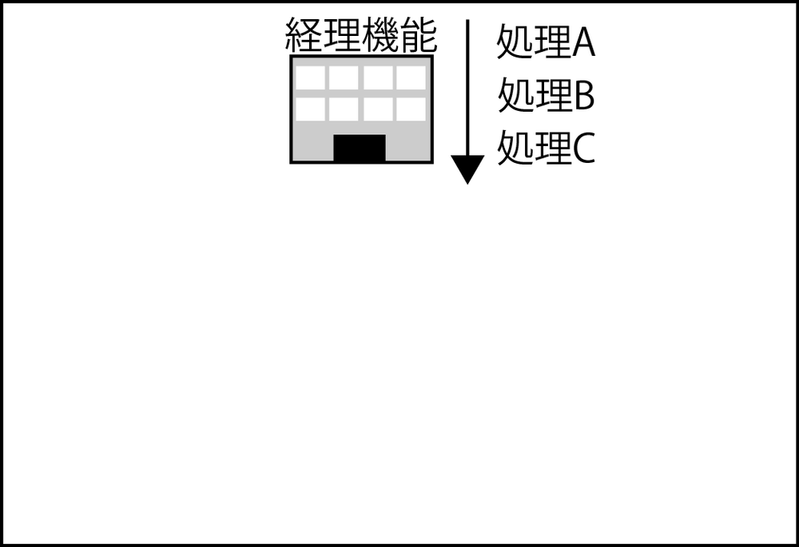

# 実行組織

* 実行組織(実装先)との紐づけ
    * 業務機能関連図に配置した`業務機能`を実際に担当する組織と紐づける
    * 組織ごとの担当業務と負荷を明らかにする
    * 処理機能の分配配置方式に従って、下記の２点の観点で進める
        * 負荷の配置調整
        * 処理能力の追加
* 業務設計は、論理的な機能をまず明らかにする
* その`物理実装先`(実行組織)として適切な組織や担当者を確認・確定する

## 類似する例

* プログラムの設計に類似する
    * 先に標準的なフレームワークなどに沿って分散配置の方針を決める
    * どこまでこれに沿って実際の処理配置ができるかを確認しながら確定していく
* ほとんどこれと同じ
* 主な処理が決まったら各クラスに分散をする、というイメージで捉える
* これが、業務設計とその物理条件検討では業務機能(受付、審査など)の組織への紐づけになる

## 例

* A部門が実行組織

* 企業・組織においては、組織形態は定期的に見直しがされる
    * この場合、論理的な機能は変わらない
        * 誰がやっても仕事の本質は変わらない

