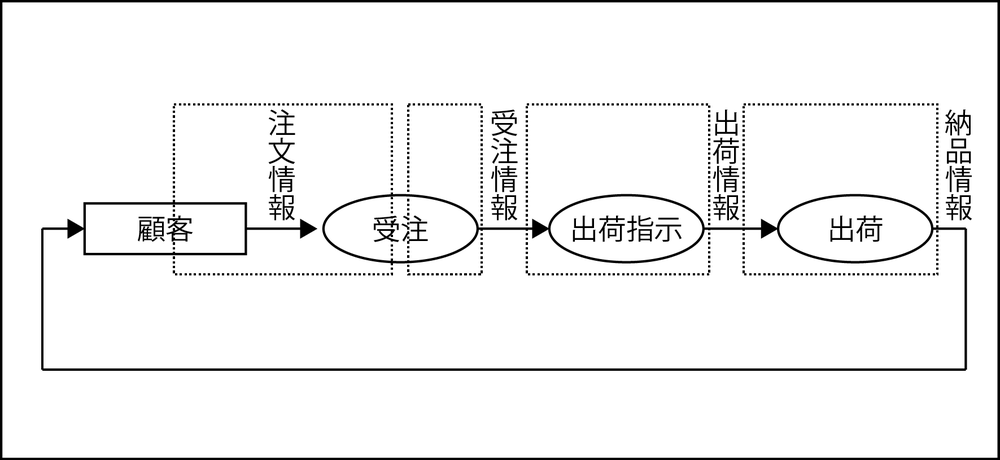

# スピードへの要求が緩い場合

別のタイミングで別の担当者が行う独立した「実行単位業務」として定義

* 01:電話受注:
    * 午前中に各受注担当者は電話で注文を受け、手書きの受注伝票を起こす
* 02：伝票入力
    * 午後、溜まった伝票を受注伝票をオペレーターがまとめて入力する
* 03:出荷指示
    * 出荷情報は、入力終了確認後に出荷担当者が一括で作成する
* 04:出荷
    * 出荷は１日１回、午後４時にドライバーが行う

* 顧客に注文を聞くことから受注の前半までが１つの「実行単位業務」になる
* 受注の後半は、オペレーターが実施する１つの「実行単位業務」として独立する
* 出荷指示と出荷は、それぞれが独立した「実行単位業務」となる
