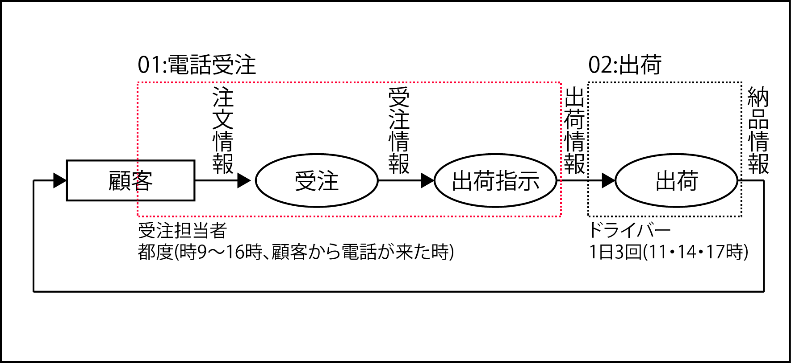

# スピードへの要求が厳しい場合

* 各受注担当者が一括で下記を一括で行う
    * 9時から16時の間に顧客からの注文を電話で受け
        * 同時に端末で受注入力を行い
            * 出荷指示書を倉庫のプリンタに出力する
                * ヘッドホンマイクを着用して端末操作し、受注から出荷指示までをその場で完了
* 出荷は１日３回、11時、14時、17時までに出力された指示書をまとめて、ドライバーが行う

* 受注と出荷指示書の２つの業務機能を、１つの「実行単位業務」として実行
    * この場合、タイミングは都度だが、トリガー条件は明らかになっている
* 出荷のようにタイミングの詳細が分かる場合は、明示しておく

## ポイント

* 論理的にまったく異なる「業務機能」をまとめて1つの「実行単位業務」に集約している
    * 「受注」と「出荷指示」を「01:電話受注」という1つに集約
