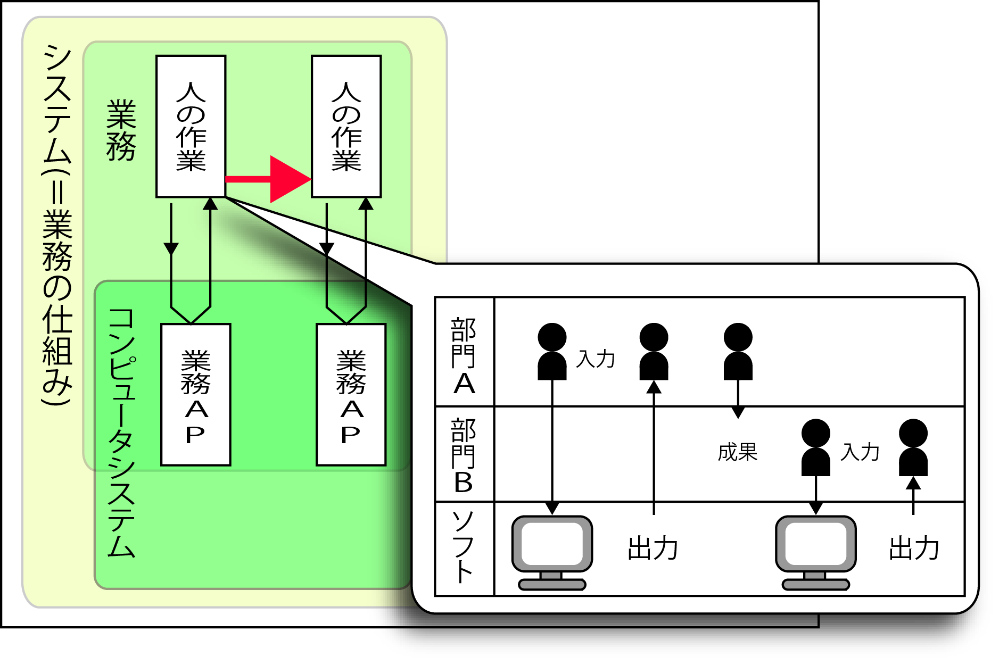
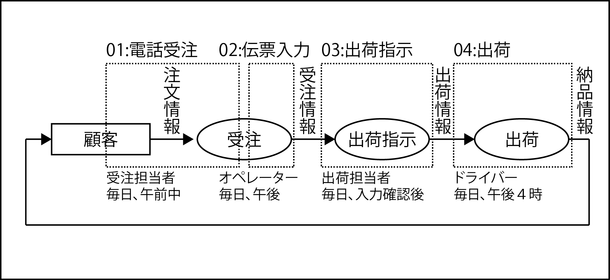
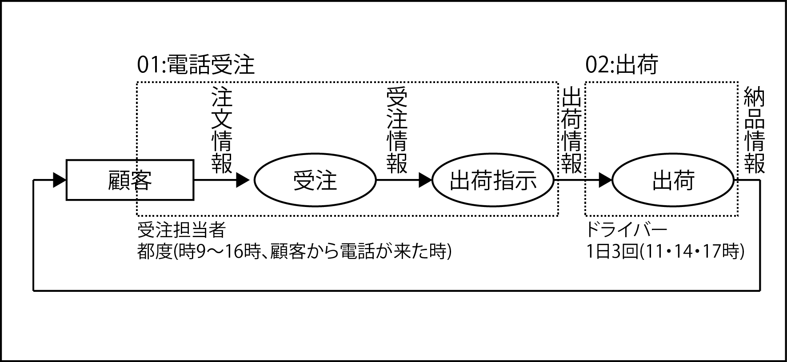

# 実行単位業務にまとめる

（論理）業務機能から（物理）実行単位業務への再編成を経て、業務設計の`論理→物理展開`が完了する

## 実行単位業務

* ユーザーが実施するひとまとまりの業務
        * ユースケースは最近「コンピュータに期待する個々の機能」から「ユーザーが実施するひとまとまりの業務」へ粒度と範囲を拡張
        * より上流の設計にも活用可能なように工夫が重ねられている
            * 現状では、「コンピュータに期待する個々の機能を記述する単位」というイメージが色濃く定着してしまっている
* 人の作業とコンピュータの処理の`両方`を含んだもの
    * 人の作業も`含めた`業務の仕組み
    * UMLなどを用いたユースケースはエンドユーザーがコンピュータを操作する場面だけを対象にした設計になってしまいがち

## 前提

* ここまでの工程で『人』はどのようなアシストを望むのかが不明確
    * ソフトウェアはまだ「人の作業」をアシストするもの

## 目的

* ソフトウェアに望むアシストを明確にする

## TODO

* 人の作業を中心に考え実行単位業務をまとめる
    * `誰が実行するのか`と`いつ実行するのか`の2つの観点を加えて論理プロセスを一段階具体化
    * 実際に実行する業務の`作業負荷の分散`と、`システムの柔軟性`の両面を保証するための設計を行う
* 論理プロセスモデルで設定した「業務機能」を`誰がいつ`実行するのかという物理実装条件の観点で`分割・統合`
* その上で`実際に実行する業務`（＝実行単位業務）に再編成する

### 論理モデルから物理モデルへの再編成

#### 例 (テレホンショッピングの場合)

* 前提
    * 『受注』は電話によって受け付ける
        * [スピードへの要求が緩い場合](01_slow)
        * [スピードへの要求が厳しい場合](02_fast)

#### 実装条件を比較

##### Case01: 現状業務の説明

* 受注担当者、オペレーター、出荷担当者が登場
    * オペレータは営業部門の所属
    * 出荷担当者は物流部門の所属

##### Case02: 新業務の提案

* 新業務では「出荷指示」という責任を物流部門から営業部門に移すという提案をしている
* タイミングも出荷指示までは随時実施
* 出荷を1日1回から1日3回に変更する

* 組織ごとに担当する`業務(実行単位業務)`が明らかにする
* 分担(負荷の集中・分散状況)と実務の前後関係が明らかにする

### 調整が難航するケース

組織間のミッションの割り当てを変更するよう提案する

* 組織間でミッションの範囲が変わるケース
* 業務の実行タイミングが変わるケース
