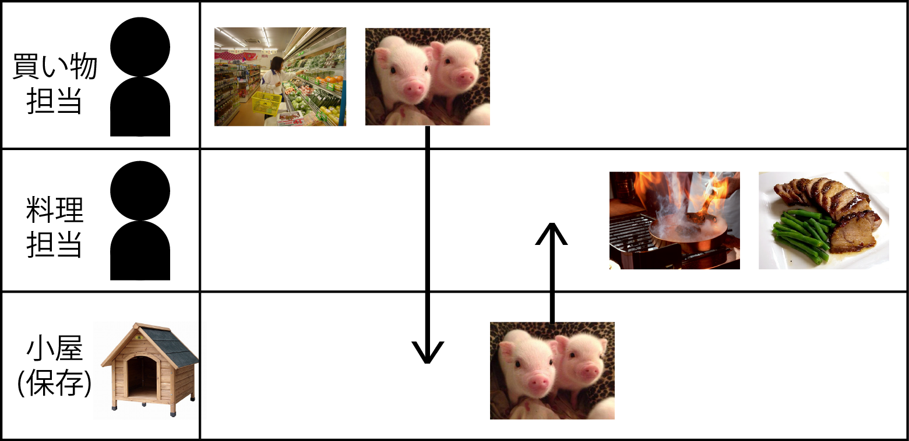
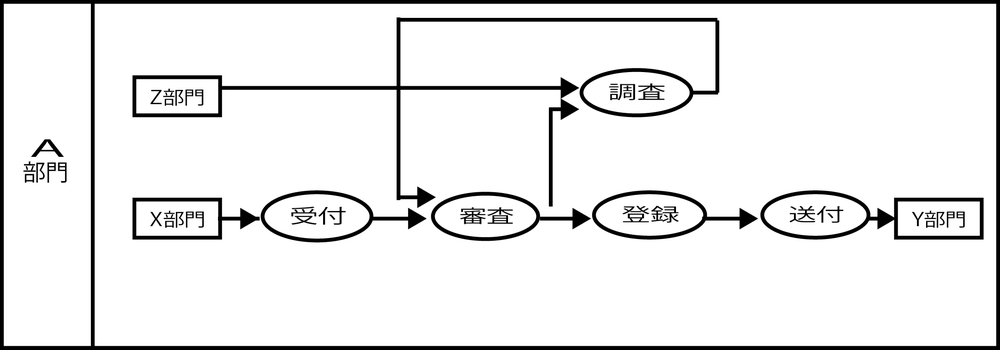

# 組織別レーン(スイムレーン)

* 組織別のレーンに切り分けた業務の「物理実装モデル」は、この設計過程を経てはじめて確定できる
    * 組織別のレーン: 論理機能の物理実装先
* 「業務フロー」は、この設計過程を経て作成する

## 書式

* 業務フローは、`業務機能`を編成し直した`実行単位業務を編成部品として`書く
* 業務機能関連図の上で図のように「実行単位業務」を切り出して、その単位で書く
    * アクティビティ図でも可

