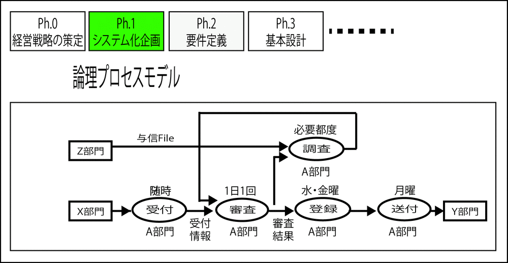
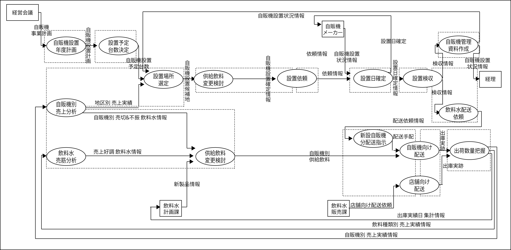

# 物理プロセスモデル

**誰がいつ**

* 業務フロー図
    * 組織の枠にはめる

## 目次

* [概要](00_about)
* [記述ルール](01_rurles)

## 前提条件

* 業務機能関連図を描いて以降、実は概念モデリングや見積もりが挟まり、企画として成立している
    * 以下が揃っている
        * 企業・組織の置かれた環境と戦略の理解
        * 新しい業務の仕組み全体の流れを描き出し
        * トピックとなるコンピュータの機能
        * それを前提とした組織と責任の分担
* `誰が、なぜ、どういう順序(いつ)で何をするか`が決まっている
* 業務の仕組み(=ビジネスモデル)の骨格が決まっている

## 業務機能の関連図の記述ルール

### 具現化

* 誰が、いつするのかに着目する
    * 具現化はビジネスユースケースからシステムユースケースへの橋渡し
    * 業務機能関連図を一段階具現化する

#### 業務機能関連図と業務機能について再確認

* 業務機能関連図：ビジネスプロセスの論理モデル（組織の枠をはめない）
    * 業務機能：業務機能関連図を構成する論理的な機能（情報の受け渡しによって機能する）

### 物理実装条件を明らかにする

* 論理プロセスである業務機能関連図に対して、２つの物理実装条件を明らかにする
    * `実行組織(誰が)と実行タイミング(いつ)`を明らかにする
* 物理プロセスモデルでは、プロセスモデリングの次の段階である物理実装条件の検討に着手

## 業務プロセス

* `ビジネスユースケース(業務プロセス) ＝ 物理条件 ＝ 実行組織 + 実行タイミング`

## 実行単位業務

### 完成図

* 複数の「業務機能」が統合/分割し`実行単位業務`を切り出した図
    * 「実行単位業務」の担当者、タイミングなどの属性は省略している
        * 担当者なども記述して良い
        

* 一般的に、用いられている業務フローや、UMLのアクティビティ図の書式で記述できるのは、物理実装業務のモデル
    * 点線で切り出した「実行単位業務」を構成部品にして描いた物理実装業務のモデル図を、「実行単位業務関連図」と呼ぶ

## 各工程のポイント

「Ph.1:システム化企画」と「Ph.2:要件定義」で明確にすべきポイントを改めて整理

* Ph.1システム化企画
    * 業務機能関連図：ビジネスプロセスの論理モデル（組織の枠をはめない）
    * 業務機能：業務機能関連図を構成する論理的な機能（情報の受け渡しによって機能する）
* Ph.2:要件定義
    * 実行単位業務関連図：ビジネスモデルの物理モデル(組織との紐づけが明らかになっている)
        * 書式は一般的な業務フローでもアクティビティ図でもよい）
    * 業務(実行単位業務)：業務フローを構成する物理的な業務（タイミング条件も調整済になっている）

