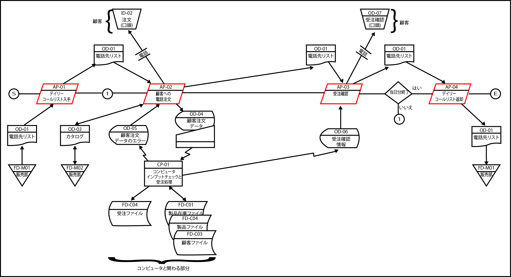

# ユースケース分析のための抽出

## 業務の手順を明確化

### 人の作業

* SからEを結ぶ直線の上に、「人の作業」を表す平行四辺形の記号が並んでいる
    * 電話を使った受注業務を表現している
        * AP-01で「電話先リスト」をキャビネ（FD-M01）から取り出す
        * AP-02でリスト上の顧客に電話をかける
        * AP-03で注文の内容を確認
    * その日の電話先の最後であればAP-04に進んで電話先リストをキャビネにしまって終了

