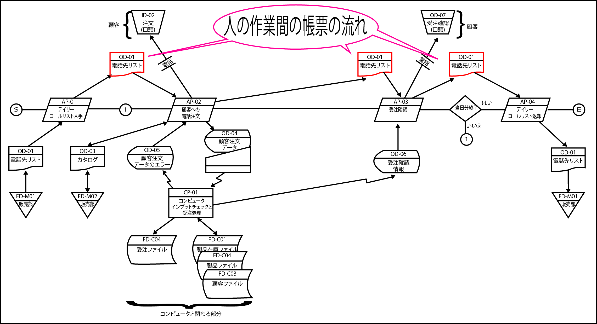
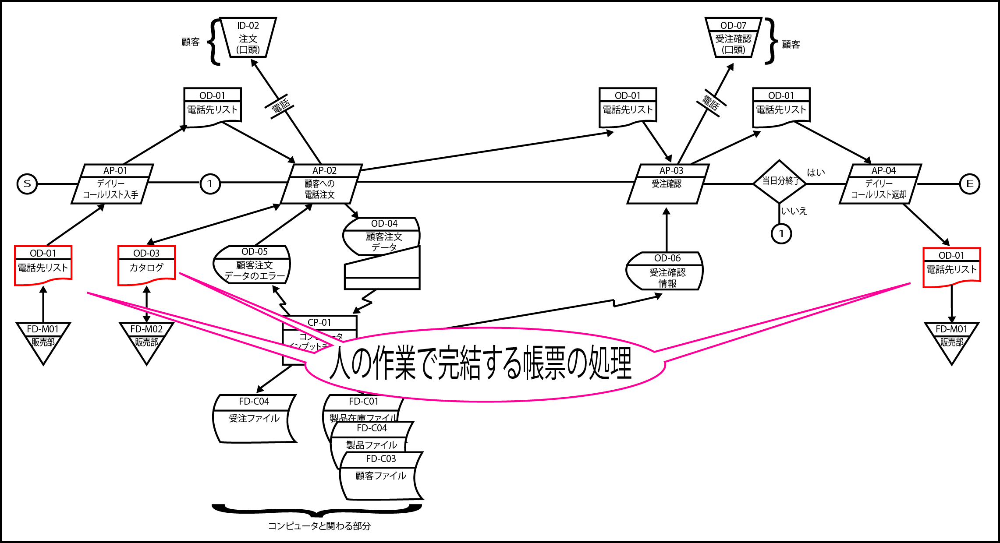
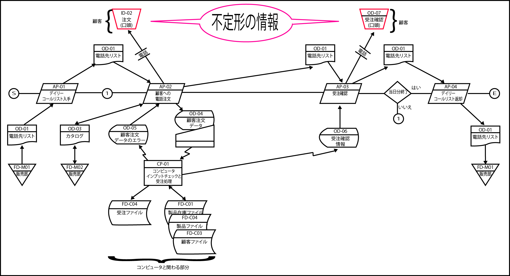
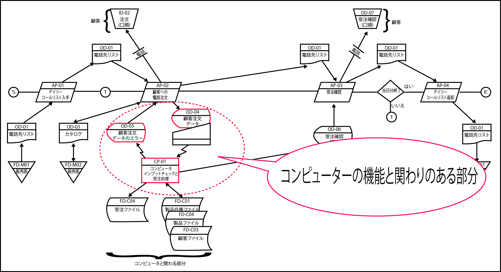

# ブレークダウンする
    
* 実行単位業務を分解して図式化し、「人の作業」と「コンピュータの処理」の両方が明らかにする

### 帳票の流れ

* 「人の作業」の周辺には、まず、この業務でハンドリングする帳票類が明示されている
    * （OD-1、OD-02、OD-03など）
* SからEを結ぶ直線より上に「人の作業」間の帳票類の流れ

* SからEを結ぶ直線より下にそれぞれの「人の作業」で完結する帳票の処理を配置している
    * 先ほどの「電話先リスト」について確認すると、AP-01で電話先リストを取り出す動作はこの作業に完結している
    * 次の作業であるAP-02に渡す動作は作業上の流れになるので線の上に書く
    * AP-02で参照するカタログは、この作業だけでしか使わないので線の下に書き、他の作業に受け渡すことはない

### 不定形の情報

* 「逆さまの台形」は、「不定形の情報」
    * この場合は、口頭（電話）で伝えられる`注文（ID-02）`と`受注確認（OD-07)`
        * 口頭の情報はフォーマットやレイアウトを決めることができない
        * 画面や帳票のようには設計できない
        * 「不定形情報」を表す逆さまの台形で表記
        * 特に電話受注業務においては、「注文」も「受注確認」も、「この情報なくしてこの業務は成り立たない！」という重要な情報
            * 入手元と渡し先を明らかにする
            * 番号を与えて明確に定義
                * PRIDEではこれを重要視し、あえて目立つ記号を使って明確に定義する事が定められている

### コンピュータの機能とかかわりのある部分

* 図中のCP-01の周辺（OD-04、OD-05、OD-06、CP-01、FD-C01〜C04）
    * 「電話受注業務」で利用されるコンピュータの機能はCP-01に集約されている
    * その周辺に画面の入出力とファイルへのアクセスが図示される

