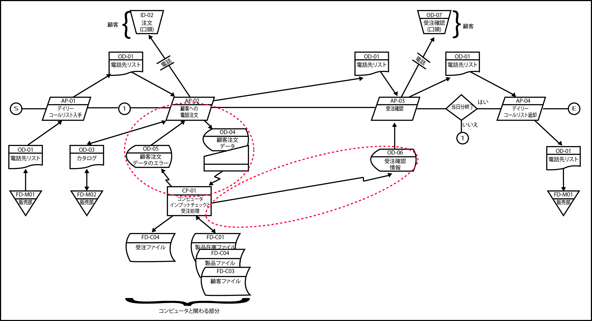

# ユースケース抽出

システムユースケースを抽出し、要件定義の工程に渡す

* 業務フローからビジネスユースケースを抽出する
* 実行単位業務を一段階分解し、事務(コンピュータの利用)の手続きを含めたその実施方法を具体化する
* ユースケース抽出では、「実行単位業務」の`両面`の具体的な実施方法を、段階を踏んで明らかにする
    * 両面: コンピュータの操作を伴わない「人の作業」と「コンピュータの操作」
        * 人の作業の存在を無視してしまうと上流工程で扱う業務の仕組み（＝ビジネスモデル）全体の中から、人の活動が抜け落ちる
* コンピュータを含めた帳票や事務の運用規定を決めることで、追って必要になる業務マニュアル作成の段階で事務手続きについて考え直す手間を省く
* 業務そのものを設計するための重要な「人の作業」の流れを図式化してユーザーに確認していく

## 成果物

業務フローチャート

## 前提条件

* 業務フローが明確になっていること

## 手順

* [実行単位業務を切り出す](01)
* [ブレークダウンする](02)

## 業務フローチャート完成図

* ユースケースの説明として普及している`コンピュータに要求される個々の機能`という単位に対応するのは、業務フローチャート上に点線で囲った単位になる
    * 例
        * 「画面から注文を入力すると在庫不足エラーがある場合、それが表示される」
        * 「（在庫不足エラーがない注文に対して）画面から出荷指示ができる」
* もし初めからこの単位でユースケースを認識すると、運用開始後に大きなリスクを抱え込む
    * AP-01やAP-04に当たる「人の作業」は見落とされる
        * その結果、顧客の個人情報が満載された「電話先リスト」のハンドリングに関する事務手続きの検討と規定の整備が漏れてしまう

## 業務フローチャートの特徴

* 各業務（実行単位業務）の開始と終了が作業レベルで明確になる
* 業務内の事務手続きの流れが明らかになる
* コンピュータの操作以外の人の作業も明らかになる
* 帳票類のハンドリング方法（入手や保管、廃棄など）が明らかになる
* コンピュータに要求する処理がすべて明らかになる
