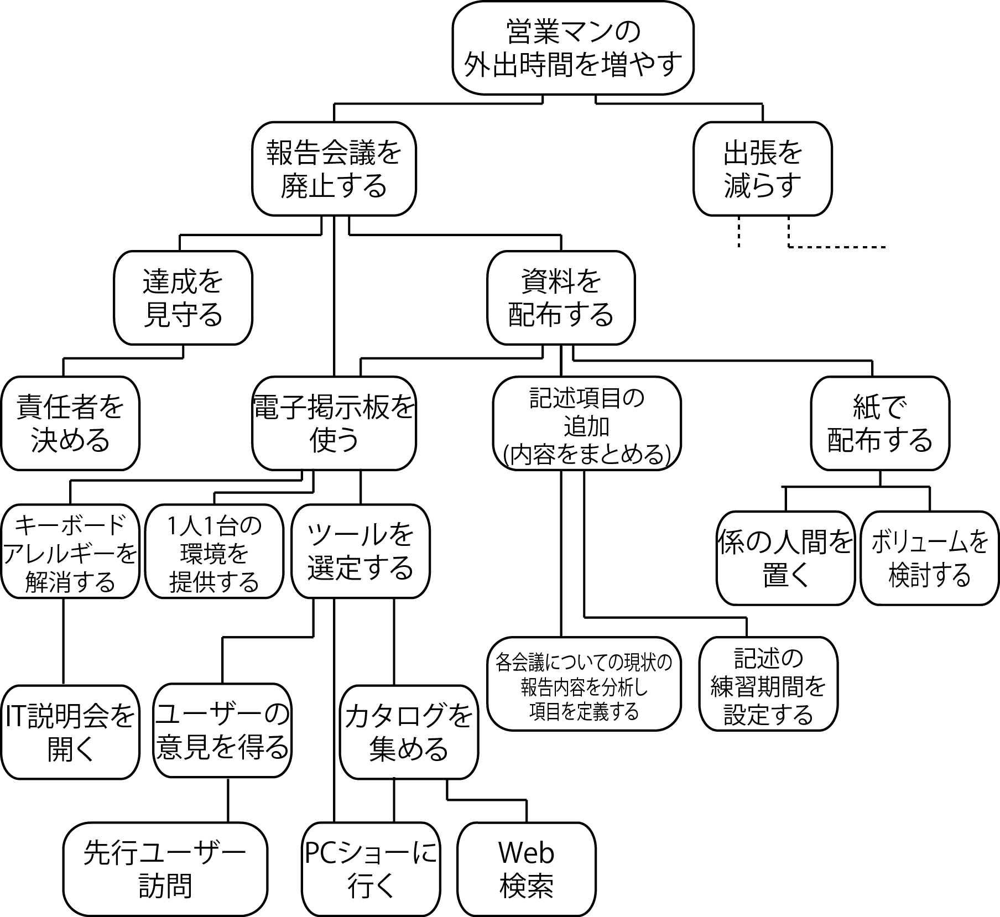
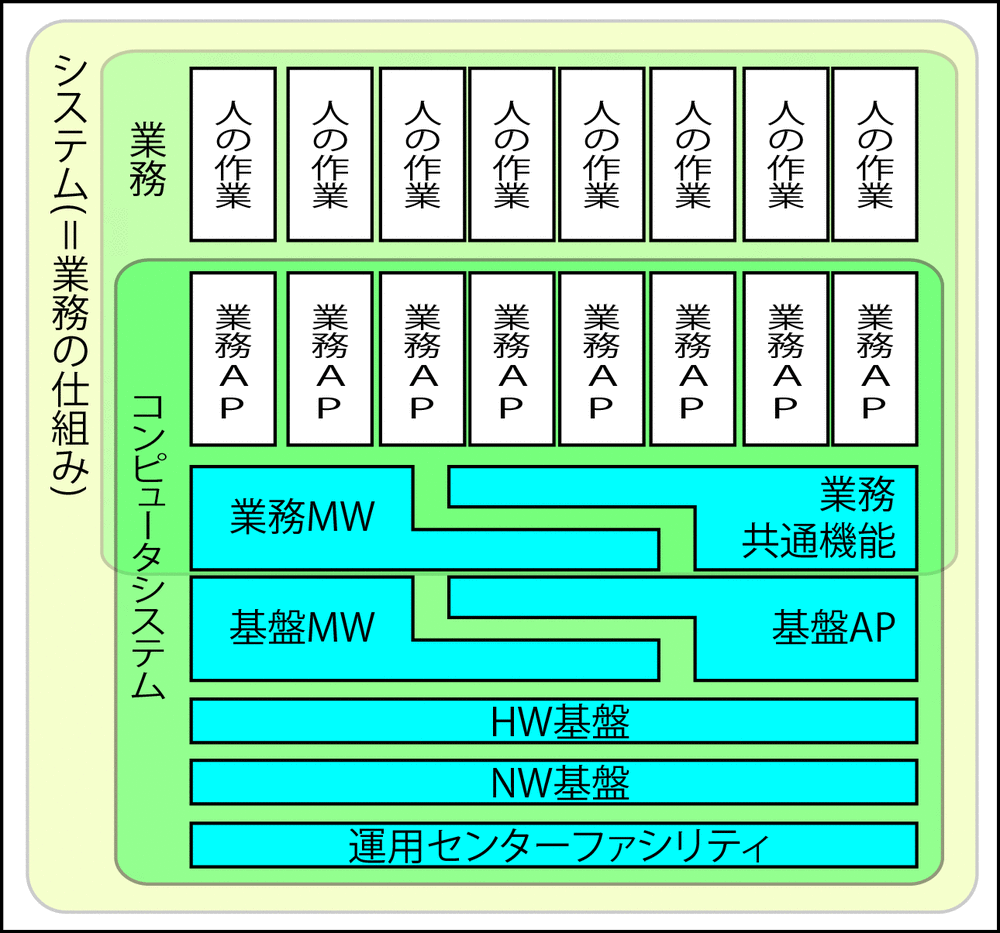

# ビジネスレベルのユースケース

ビジネスユースケースは、**システムレベルユースケースとは別物**

* 業務プロセス
* `利用者`の行動を検討する
* `利用者`がどんなふうに行動するようになるか
    * 利用者の行動を全部出し切って並べる
        * 時系列で順番に検討していく
        * そのため図式化していく
        * 結果的にソフトウェアの要件定義の際にはこのビジネスユースケースが必要になる
* 企業活動の振る舞いを記述することが目的
    * 大きな視点で書かれる

## 手順

* [プロセスモデルの作成](01)
* [ビジネスユースケースから得るもの](02)
* [ユースケース抽出](03)
* [企画書にまとめる](04)

## ユースケース(行動シナリオ)の必要性

### ビジネスユースケースを必要とする理由

必要とされるソフトウェアがどういうものなのかを確認可能にするため

* ソフトウェアを必要とする仕事を明らかにする
    * 明らかにした上で要件定義工程へ渡す
* `顧客が商品を注文する`という台本があるから、その行動を支えるために`商品注文画面`という小道具が必要
* 誰も利用しないソフトであれば、実現する価値・意味がない
* あくまでソフトウェアは、それを使ってもらうことによって利用者の行動・便益を支える為にある
    * 利用者の行動をどのように想定・設定するかが先にないと、システムユースケースを定義することはできない
        * システムユースケース: ソフトウェアの要件
    * システムユースケースの前段階で、ビジネスユースケースを定義することが必要
        * ビジネスユースケース: 利用者の行動シナリオ
        
## プロジェクトマネジメントと工程設計とWBSとプロセス

* プロジェクトもそれ自体が大きな一つの仕事
    * その仕事（ワーク）を小分けに（ブレイクダウン）して構造化（ストラクチャ）した形で管理する
    * WBS（Work　Breakdown　Structure)
* 重要なのはWBSの書式ではない
    * WBSを通じて表現されているプロジェクトの入れ子構造の仕事が各工程として連鎖しているかどうか
    * PMは、プロジェクトそのものの要件定義ができなければ工程設計など覚束ない

## 主な対象となる層

