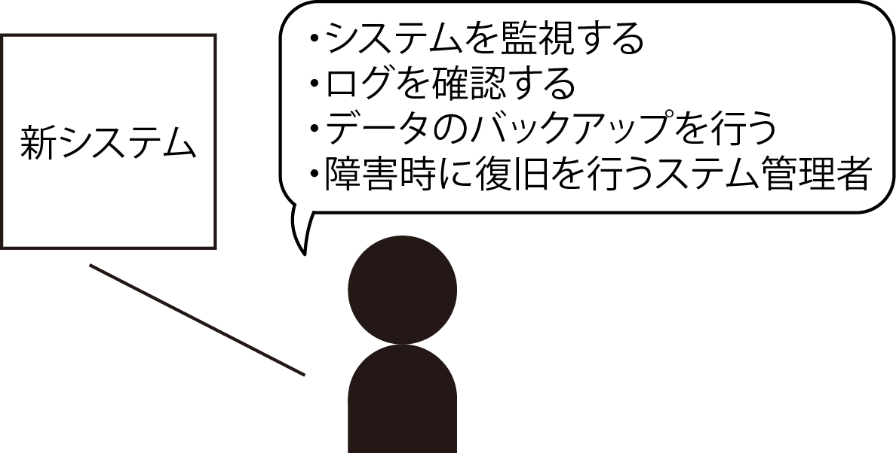
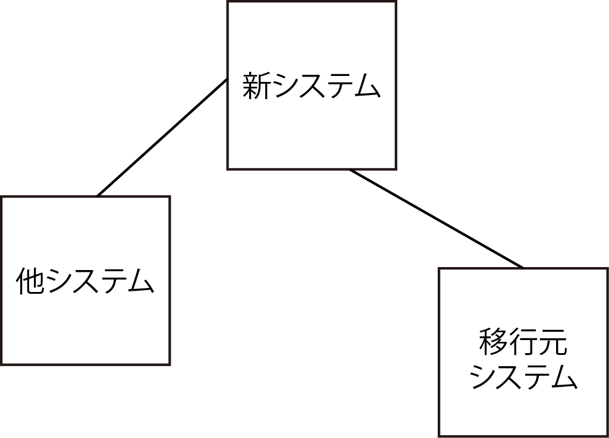
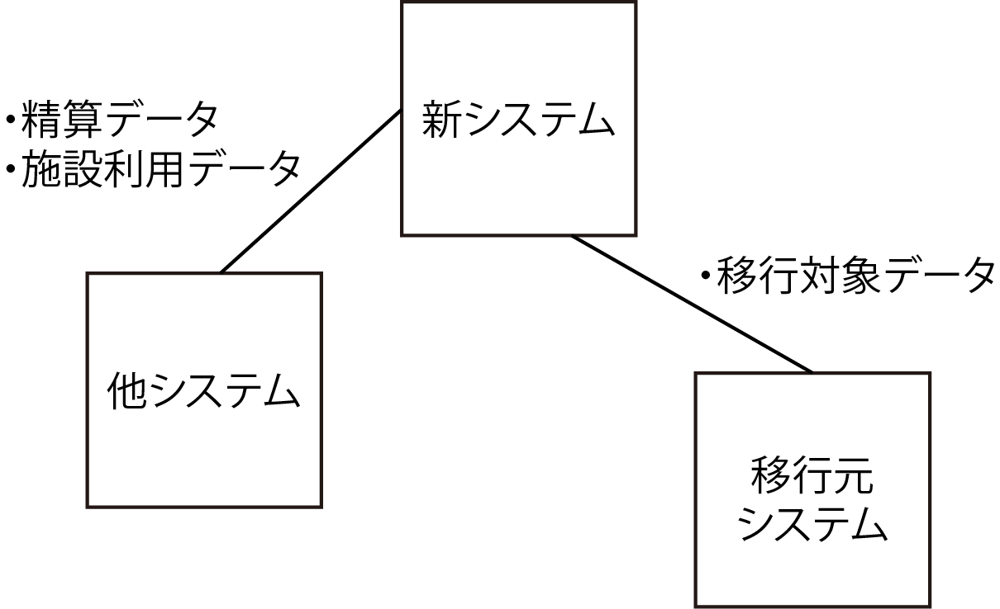

# 描く際の注意点

## 利用者としてのシステム管理者を含める

* システム管理者が「不正アクセスを監視する」ことを行う場合
    * ＝ システム管理者に対して、`不正アクセスを監視できる仕組みを提供する`

## 連携するシステムがあれば併せて描く

特に業務システムの場合は「連携するシステムとしての移行元（現行）システム」というのを絶対に忘れない

* 連携するソフトウェアやシステムがある場合
    * その連携先の要求に応える仕組みを要件に追加する必要がある
* 場合によっては連携先に対して機能の追加や変更などをこちらから依頼する必要が生じる
* 特に移行元のシステムがある場合
    * 移行のために用意する要件や並行稼働の実現のために必要となる要件がある
    * それらを常に再確認できるようにする
        * これから作る予定のソフトウェアの利害関係者（ステークホルダー）として、連携するソフトウェアをシステムを必ず記載

## 連携する内容も忘れずに描く

* 連携先との間には、何を連携するのかを記載する
    * 想定しているものについては必ず記載

* Iotの場合
    * Internet of Things: 利用者不在のいわゆるセンサーコンピューティング
    * そのセンサー端末がステークホルダーでもあり連携先でもある
