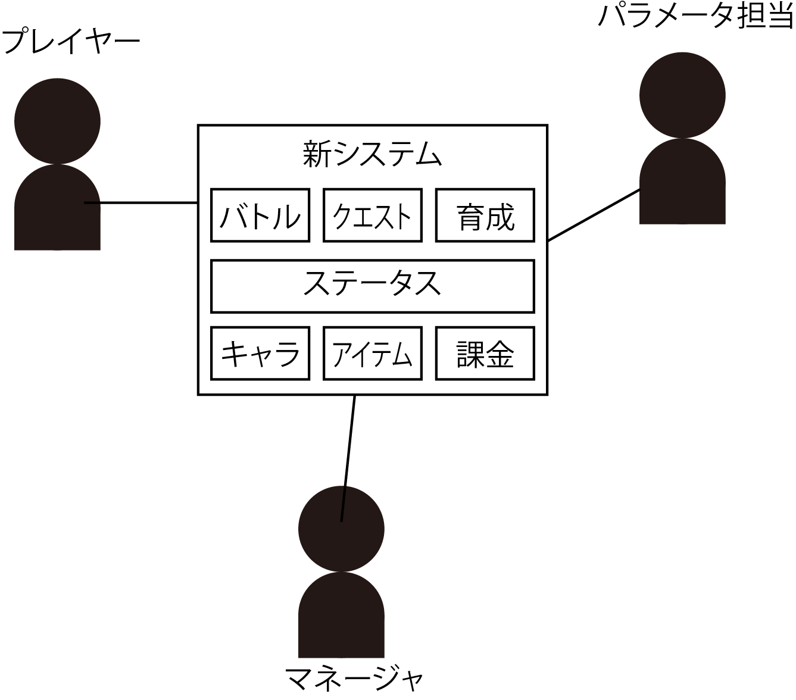
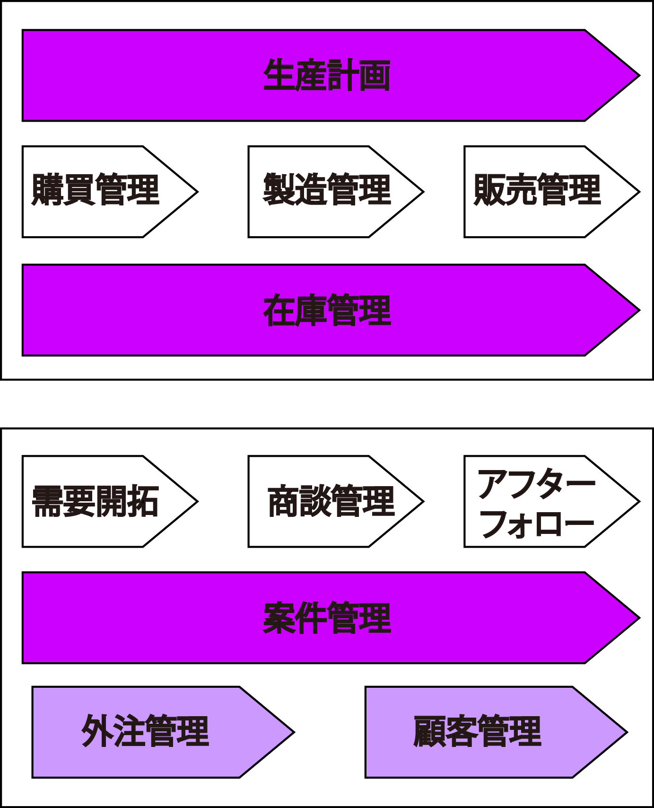
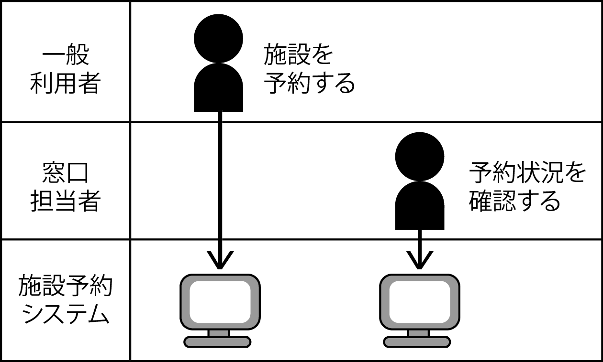

# パンフレット(全体像)を描くプロセス

## 全体像を描く手順

そのソフトウェアは利用者に対して**こういうことを行える様になることを提供する**ということを示すことで合意形成の迷走を避ける

## 骨格を描く

* まず真ん中に四角を描く
    * 今回作るソフトウェア
* その四角の周りに利用者(ステークホルダー)を描く
* その利用者のそれぞれに、そのソフトウェアを使って行うことを描く
    * ステークホルダーとのやり取りを描く
        * やりとり: 受け渡し
            * 利用者はソフトウェアと情報の受け渡しをする

## サブブロック図を作成する

* 四角の中をいくつかの区画(内部連携の図示)
    * 見通しをよくする
    * これをサブブロックあるいはサブシステムと呼ぶ
        * この区分けは全体像における連携先の記載と似ている
* 担当する人の経験や実力、さらにいうとセンスに左右されるため難解な作業

### 例1

### 例2

## スイムレーンにコンピュターを追加する

* ソフトウェアも行動シナリオ上の登場人物の1人として描く
    * 利用者と情報の受け渡しをするため
* 利用者の`誰がいつ`ソフウェアとやり取りをするのかということを明記する
* ソフトウェアのところにはUIであることがはっきりと分かる形を描く

