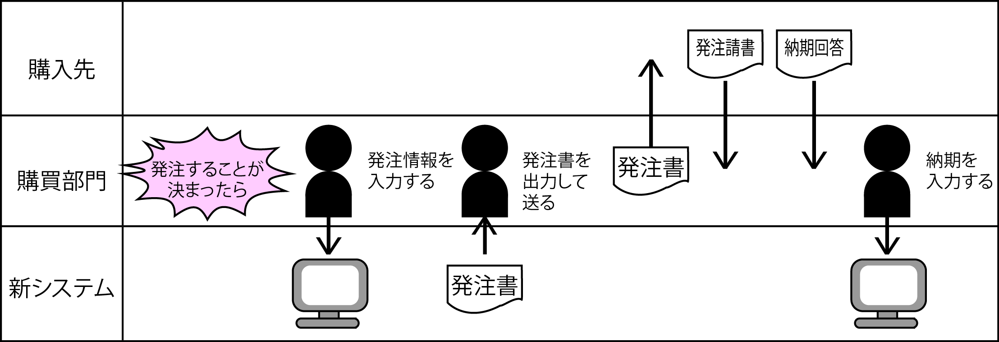

# 実効単位業務関連図を修正する

* 行動シナリオ(＝実効単位業務関連図)を仕上げる
    * コンピュータを含めた要件定義を行う為のシナリオにする

## 明確にする点

* UI(コンピュータ)の出現場所
    * 誰が何をするためにソフトウェアを必要とするのか

## 特徴

* 仕事同士をつなぐ線を排除
    * 線: 仕事の連鎖としての前後関係を実現するための線
    * 左から右へ勝手に時系列を読み手が感じ取ることを期待
* その結果、図に現れる矢印は登場人物（ソフトウェアを含む）同士の受け渡しを実現するのみになる

