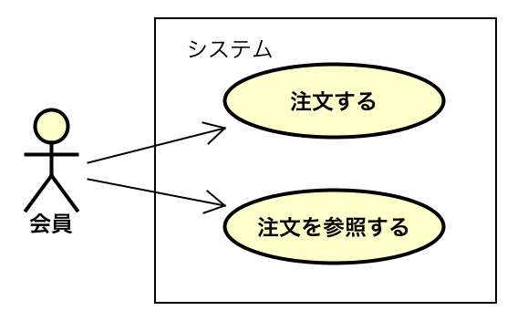

# UMLでユースケース図を記述

* アクターとシステムの間で、どのようなやりとりが行われるのかを視覚的に表現可能
    * 視覚的に表現することで関係者のイメージが広がり、共有もしやすくなり、ユースケースの抽出が容易
    * 大規模システムや企業システムのようにある程度複雑なシステムでは、網羅性に限界がある
    * B2Cであれば、業務フローなどの手段が使えないので、ユースケース図を記述するのが適している
        * B2C: 一般の消費者向けのシステム

