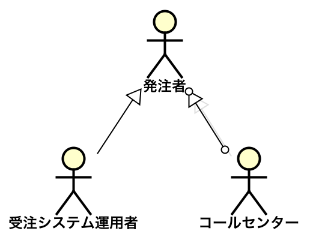

# アクター

* 利害関係者の中でシナリオの中心になるもの
* アクターは、システムの利害関係者
    * アクターはシステムと相互作用することもある
* ユースケースのシナリオに登場しないアクターも存在
    * シナリオに登場するのは、システムを直接利用するアクターのみ
        * 間接的に利害が発生するような操作代行してもらっている利用者やシステムの所有者
        * システムを監査する立場にある人たち
* アクターは人間だけではない
    * 別のシステムやバッチスケジューラetc
* アクターは、特定の個人を指すのではなく、役割(ロール)を指す
    * ただし、システムの認証におけるロールではない
    * システム認証でのロールはログインしていないと識別不可だが、ユースケースのアクターはそうではない
    
## 主アクター

* ユースケースのシナリオの主体になるアクター

## 支援アクター

* 主アクターではないがシナリオに登場するアクター

## アクターの目的

* アクターには`目的`がある
* その目的を達成する意図があってユースケース記述のシナリオを実行する
* シナリオのステップは、手順を書くというよりも、アクターの意図を描く
* アクターの視点で記述する
    * アクターがシステムに何をやらせるのかを考える
    * ユースケースを抽出する時にもアクターの視点は重要
    * システムの担当者は、ついついシステムの視点で記述しがち

## アクターの抽象化

* 名前を付ける
    * コールセンターと受注システム運用者が同様に注文できる場合
        * どちらも発注者アクターのサブクラス
            * ただし、UMLの継承(特化)の矢印は、慣れていないと逆の意味にとらえがちなので、
            * ヒアリング対象の業務担当者には十分な説明が必要

