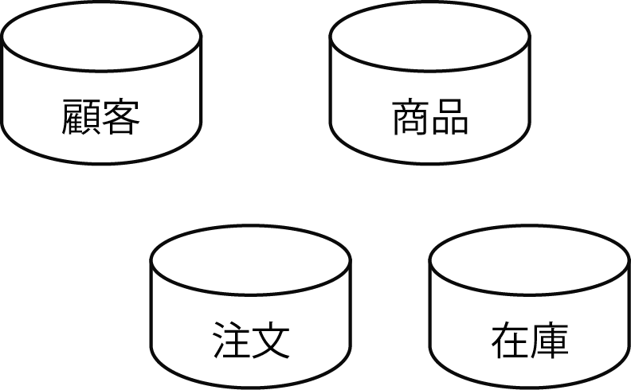
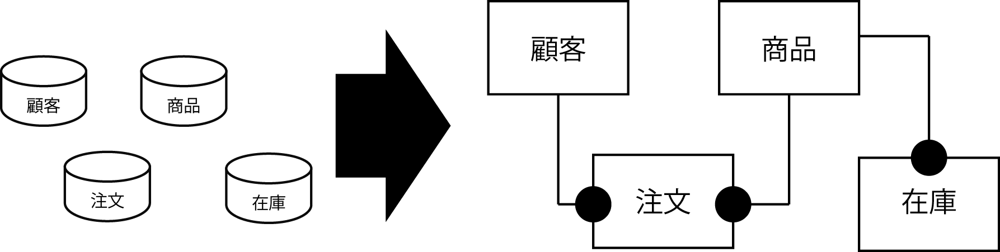
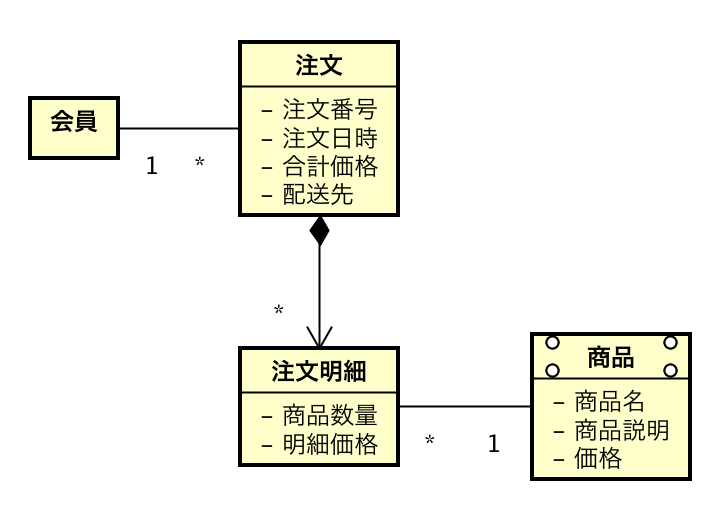

# 概念データモデルの作り方

* ドラム缶程度の図に概念を当てはめていく
    * ERDが描ける方はERDで良い
        * ERD: Entity Relationship Diagram
* ここではまだ正規化などは特に厳密に考える必要はない
    

* ユースケース(行動シナリオ)を材料として名詞・動詞を抽出する形で進める
    * 片言日本語的な進め方が簡単
    * 「ワタシ、サラダ、タベル(私はサラダを食べる)」のようにとらえて要素を抽出する
    * ユースケース(行動シナリオ)から「顧客が商品を注文する」ということが読み取れる場合
        * `顧客` `商品` `注文` と要素を分解
        * それぞれに`顧客データ` `商品データ` `注文データ`としておけばよい
        

## 描き方

* 概念モデルはUMLのクラス図で記述
    * 例: 注文に関する概念モデル
        * 概念モデルは、日本語で記述する
* ユースケースに登場した概念を概念モデルに記述する
    * ユースケースは日本語で表記するため、概念モデルも日本語で記述する方が対応付けて考えることができる
* 概念モデルでは属性の型は不要
    * 属性の型: intやStringなど
* 概念モデルをクラス図で表す場合は、操作は書かない

## 概念モデルで表現するもの

基本的に次の３つ

* 概念の名前を整理する
* 概念の関連を整理する
* 概念の関連の多重度を整理する

