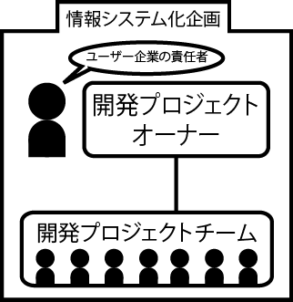
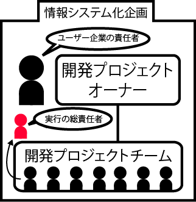
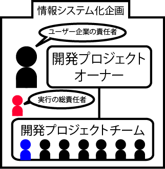
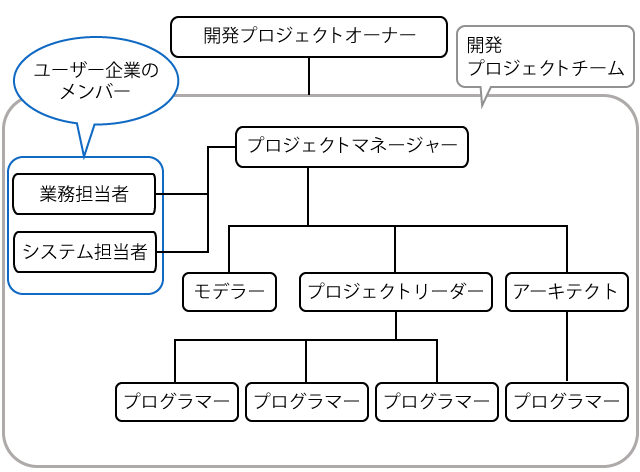

# チームの結成

* プロジェクトチームの結成
* プロジェクトマネージャーの選出
* プロジェクトリーダーの選出(大規模の場合)
* プロジェクト組織の全体像

## プロジェクトチームの結成

* 基本的に、システム開発はプロジェクトチームを結成して行う
    * 開発プロジェクトチームは、目的を達成すると解散する
    * チームに目的を与え、成果物を受け取るのが開発プロジェクトのオーナー
    

## プロジェクトマネージャーの選出

* プロジェクトマネージャーは、開発プロジェクトを統括する開発プロジェクトの最終責任者
    * システム開発会社から選出することもあれば、ユーザー企業から選出することもある
    * ユーザー企業からプロジェクトマネジャーを選出する場合は、ユーザー企業が開発に深くかかわる
* 開発プロジェクトの計画を策定し、計画に沿って実行
* 実行結果を評価・管理
* プロジェクトの計画だけではなく、実行の総責任者でもある
* ユーザー企業やプロジェクトチームのメンバーなど、さまざまな人々の間で調整を行う
    * 高いヒューマンスキルが要求される職種
    * プロジェクトマネジメントの専門知識を持った人が行う専門職
* プロジェクトマネジャーのもとには、プロジェクト計画に沿ってメンバーが配置される
    * プログラマ、プロジェクトリーダー、システムエンジニア、アーキテクト、スペシャリスト、コンサルタントなど

## プロジェクトリーダーの選出(大規模の場合)

* 大規模プロジェクトではプロジェクトを分割してプロジェクトリーダーを配置
    * プロジェクトマネジャーの指示のもとで、配属されたメンバーに指示をしながらプロジェクトを実行する
    * プロジェクトリーダーとプログラマは幅広い役割を担う

## プロジェクト組織の全体像

* 開発プロジェクトチームにユーザー企業の担当者を入れることで、プロジェクト運営が円滑に行われる
    * プロジェクトに加わるのは、業務に詳しい業務担当者や、ユーザー企業の既存システムに詳しいシステム担当者

## 備考

* PMBOK: ProjectManagement Body of Knowledge
    * 従来は、QCD(品質、コスト、納期)の３つの視点でプロジェクトを管理してた
        * QCDではシステム開発を結果だけで評価しがち
    * PMBOKでは9つの知識体系でプロジェクトの計画、実行、管理を行う
        * QCDに比べてバランスの良いマネジメントが可能
        * 標準化された指標に沿った近代的マネジメントが可能
    * PMの考えるべき知識領域がが定義さている
        * PMのスコープ(プロジェクトの目的と範囲)
        * 総合管理etc,,
    * PMBOKを提唱したPMIはプロジェクトマネジメントの認定制度である`PMP`を運営している
    