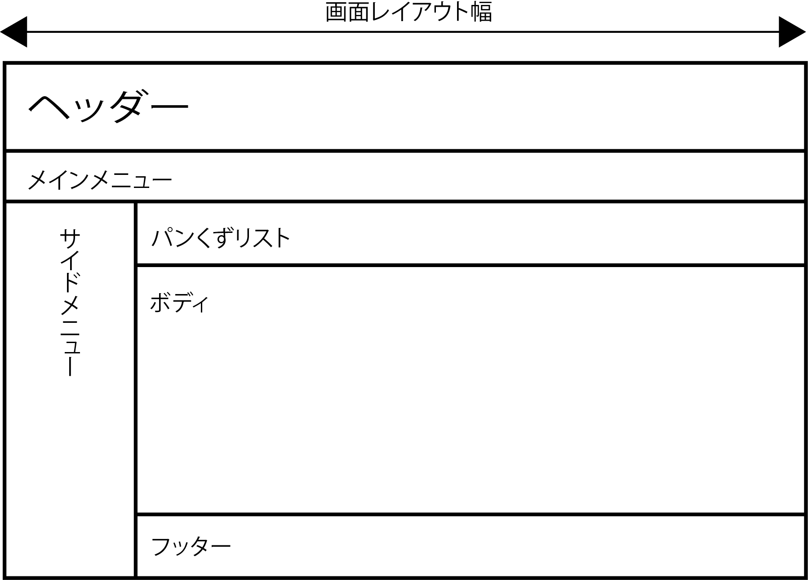

# 画面レイアントパターン

* ヘッダー、フッター、メニュー、ボディなどの画面の共通レイアウトを設計する

## 例

### 各画面の共通部分

* メニューは２種類
    * ヘッダーの下にはメインメニュー
        * メインメニューには、このシステムのコンテンツや機能へのリンクが貼られる
        * サイドメニューをサブメニューとして使用
            * 選択されたメインメニューに応じてメニュー項目を切り替える
    * 最下部にはフッター
        * フッターもヘッダーと同じような使い方が可能
        * ロゴやタイトルを表示したり、ヘルプのような基本的な機能へのリンクを配置しても良い

### 表示するページによって内容が異なる部分

* パンクズリスト
    * Webサイトの中で現在表示しているページの位置を、階層構造の上からリンクとして表示するもの
    * `[TOP] ＞ [注文] ＞ [注文照会]`
* ボディ
    * そのページのコンテンツが表示される
    * コンテンツの量が多い場合は、ボディが縦に長くなる
        * ブラウザでスクロールされるようになる

# 共通化を先に行わない考え方

以下のような考え方もある

* 先にヘッダーやタイトルなどの共通部分を決めない
    * はじめに目的ありき、ゴールありきである
    * ワークセットごとに徹底的に詰めた上で、それらを俯瞰的に検討する
        * その後、操作性の統一を図ることがより一層の企画目的達成に寄与すると判断してから行えば良い
* 「操作性の統一」というお題目で不合理で日直感的で使い勝手の悪い操作性に統一されても困る
* まずは最高に「利用者が使いたいと感じる」ワークセットを１つ描く
* その次に２つ目を描く
* ３つ目まで書いた後に、それらを並べてじっと観察した時に共通項として浮かび上がってくる
    * それが共通化したほうが良いかもしれない対象