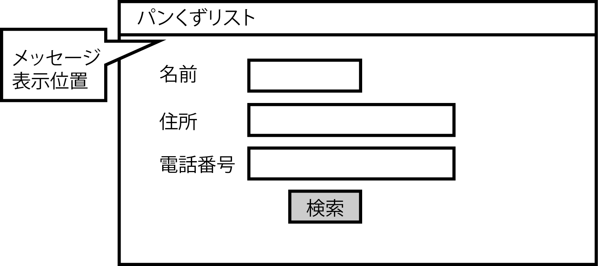

# 検索画面パターン

検索条件は表組みになっており、項目名と項目入力フィールドが対になっている

* 検索ボタンは、検索条件の下に中央寄せで配置
    * 検索条件が多い場合は、スクロールして隠れる可能性がある
    * ボタンの配置についても統一したポリシーが必要になる
* 検索画面のパターンには、検索条件が何も入力されないような不正な条件の時にエラーメッセージを表示する
    * そのような場合は、メッセージ表示位置やメッセージの色なども明確に規定しておく必要がある