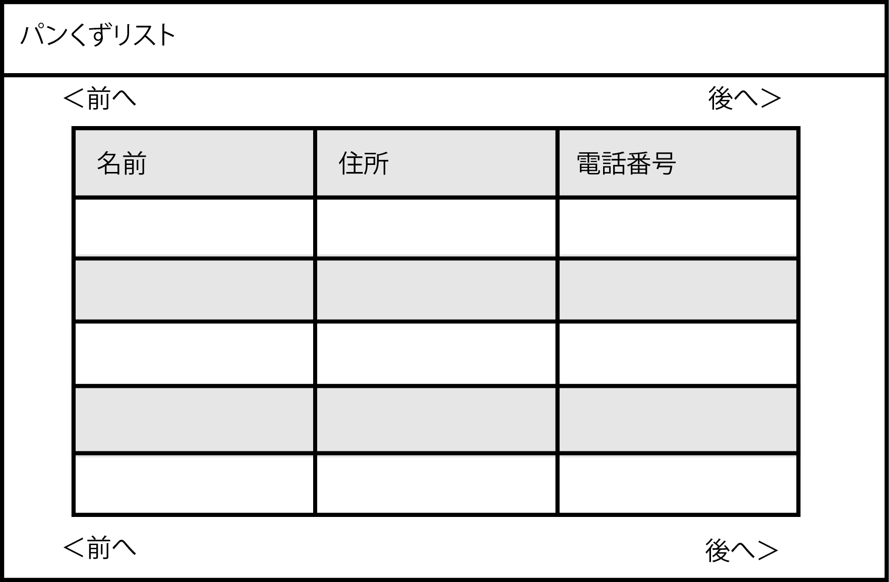
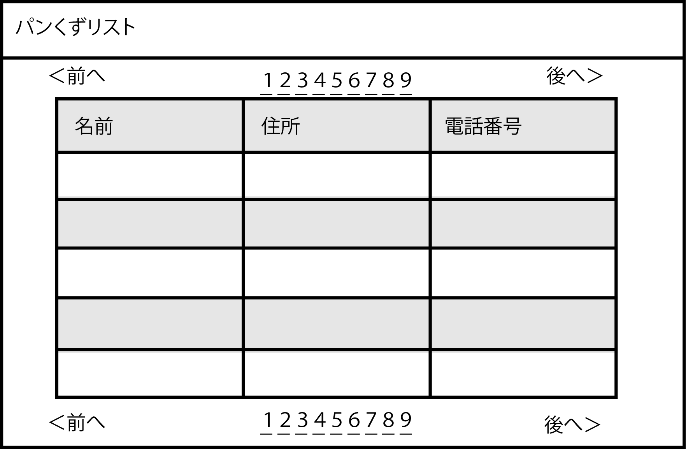

# 一覧画面パターン

* 一覧画面では、件数が多い場合にページャーによるページ制御について検討する
    * そのようなページ制御をする場合に、この表示の方法によってプログラムの作りも変わる
        * 単に「前へ」「次へ」だけなのか
        * 幾つかのページ番号を横並びに表示してリンクを表示するのか
* 一覧の各行を交互に色分けするかなど見え方を検討する
    * 各行を色分けすることで見やすくなる
    

## ページ番号にリンクをつける表示方法の場合

