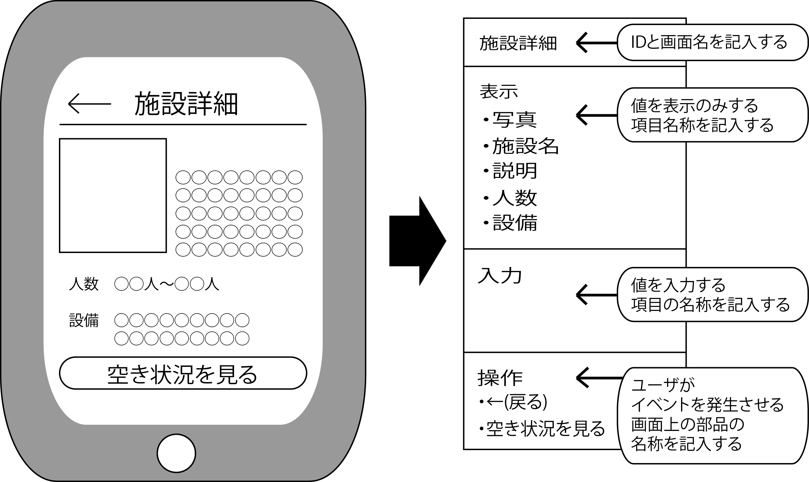
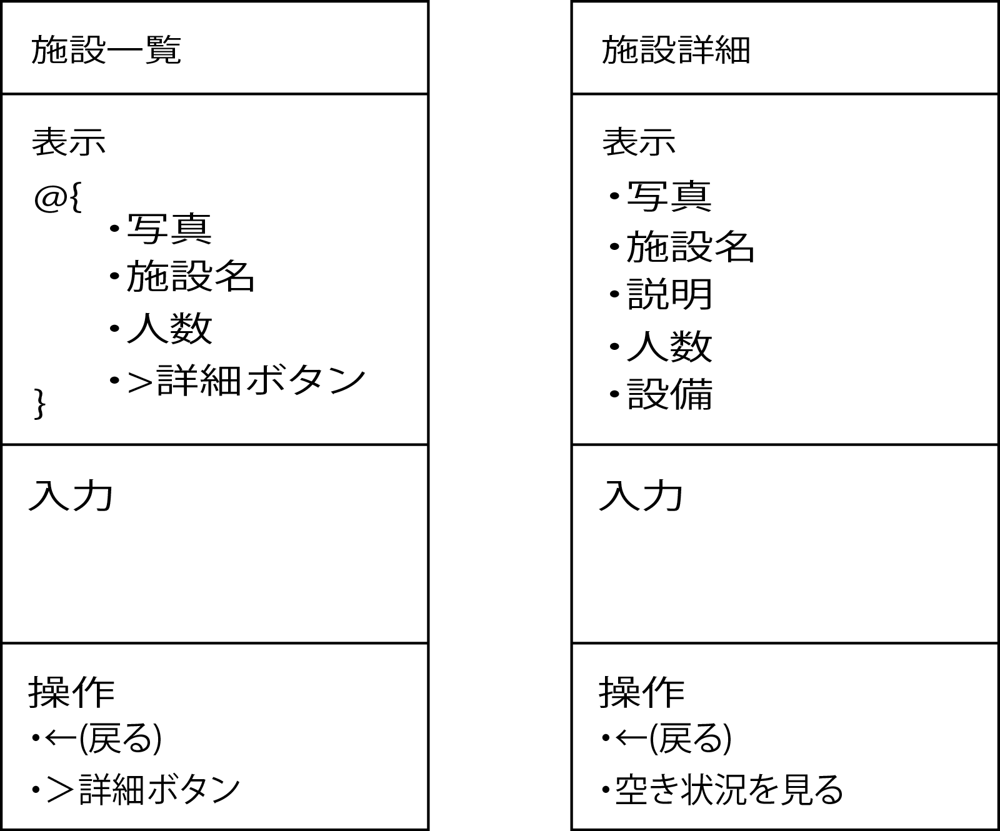
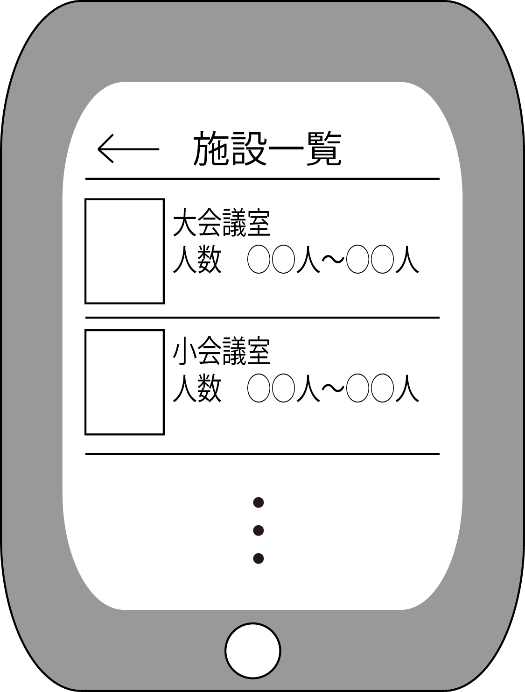
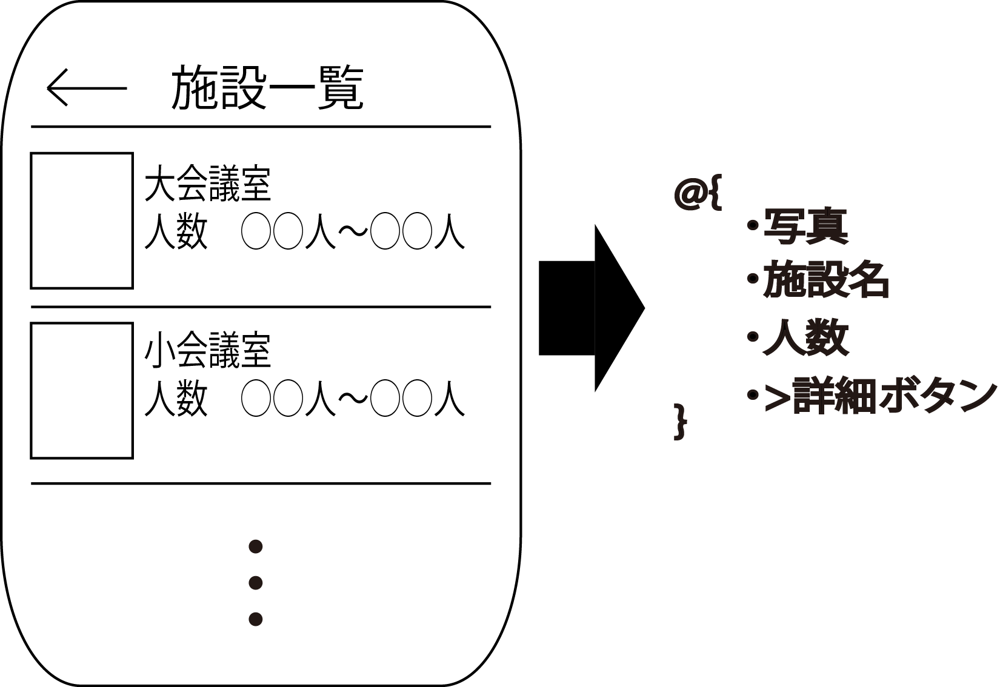

# 必要な項目を列挙

描いたラフイメージを見ながら、そこに出てきた項目を拾い出して列挙

* UIを定義する3要素のうち2つが項目
    * 1つは「データ項目」で、もう1つは「操作項目」
        * データ項目は表示や入力するもの
        * 操作項目はボタンなどの利用者が操作するもの

* 画面ごとに次の図のようにまとめて画面遷移図を作成
    * 写真などの画像は、データとして扱うべきものは、項目として必ず列挙
        * 商品カタログの写真であれば、商品データの一部
        * 投稿したユーザのアイコンであればユーザデータの一部

## リストなどの繰り返し項目の表現

* 同じ項目名が何度も繰り返し出現する場合
    * Twitterのタイムラインなどのようなリスト主導型etc

* 以下のようにすると繰り返しを表現可能

