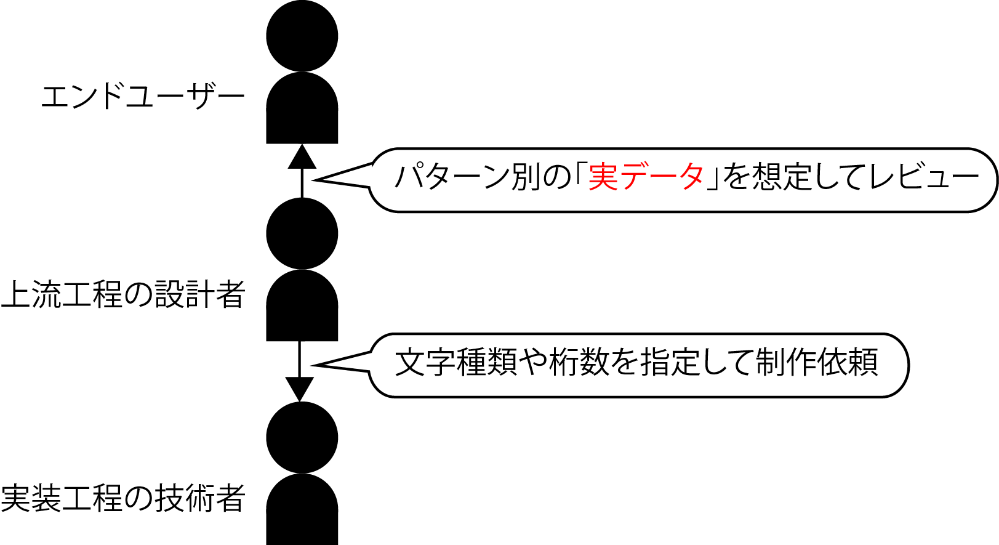

# UIとしてのエラーメッセージ

* エラーメッセージは利用者に対して物事を通知するだけでなく、何らかの対処を促す役目も担う
    * そもそも入力チェックを行うことがワークセットのゴールではない
    * しょせんは支援機能にすぎない
    * 入力チェックをして「エラーです」と返すよりも、そもそもエラーを返さずに済むような工夫を考えるべき
    * どうしてもエラーメッセージを返さざるを得ない場合に備え下記の3つの項目を必ず用意
        * 現象
        * 原因
        * 対処方法
    * 例: 電話番号という項目に入力してもらう場合
        * チェックルールとして`数字とハイフン以外の文字は入力不可とする`という風にする場合
        * そこにアルファベットなどの文字が入力された場合のエラーメッセージは、次のようになる
            * `電話番号の入力が不正です（現象）`
            * `許可されない文字が入力されました（原因）`
            * `数字(1～9)またはハイフン(-)のみを使って再入力してください（対処方法）`
    * 何が起こったのか、なぜそんなことになってしまったのか、そして自分は何をどうすればよいのかという利用者の心理に対しての納得を組み立てるために必要な情報を提供する
    * 対処方法を自動化できないかをこの時点でもう一段深く考えてみる
        * 本当に再入力を促さないとだめなんだろうか
        * プログラムの側で自動的に補正することはできないだろうかetc
        * よりユーザーフレンドリで、結果としてワークセットのゴールにより近づくソフトウェアになる
    * 何でもかんでもとにかく入力チェックしてすぐにエラーメッセージを出力する、というのは反応的に仕事をこなしているだけ

## サンプルデータの用意

* `Ph.3：基本設計`では、事務手続きの手順と並行して、使用する画面や帳票などのレイアウトも確定する
    * 全ての画面・帳票、そして不定形の情報を事務手続きに照らして確定させていく
    * 画面設計を進める場合の注意点は、9999やXXXXを使わないこと
    * 全ての画面、全てのパターンにおける入力と表示の両方で、実データを想定したレイアウト設計を行う

* 実装工程を担当する技術者のためのアウトプットは、文字種類や桁数を指示するために「9999」や「XXXX」になる
* 「サンプルデータ」の入ったレイアウトを用意する
    * ユーザーに、その項目は何桁がよいのか決めてもらう
    * 文字項目か英数字項目化などを決めてもらう
　逆に言うと、、
* 画面レイアウトの設計工程に至るまでにその画面に入るべきサンプルデータが想定できるレベルで業務知識が整理されているかどうかが設計やの勝負どころ
* 最上流工程からユーザーと向き合ってきた設計者が、いざレイアウト設計の段階になってどんなデータがそこに表示されるかを把握していないとしたら
    * ユーザーはとてもそんな設計者の提案に従ってシステム全体の開発を任せられない