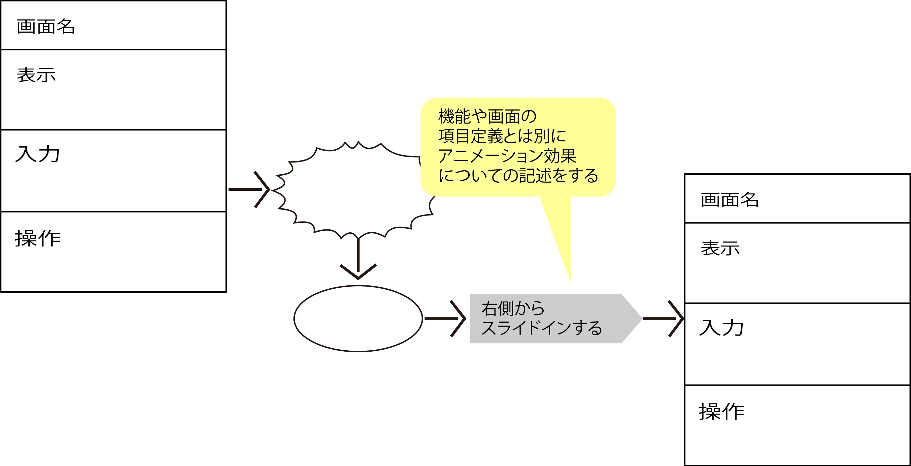

# デコレーション

* ビジュアルデザインについて詰める
* 配置、カラーリング、タイポグラフィ、グラフィックス、などの要素について決めていく
    * あくまでもワークセットのゴールを阻害しないことが重要
* これらの内容はラフイメージに反映しておく
* 場合によってはこの時点でかなり詳細なUIモックアップとしてまとめておくことになる

### エフェクトやアニメーション

* 昨今のUIでは、様々な画面効果(エフェクト)やアニメーションを施すことが増加
* このタイミングでこんな処理を行って欲しいというリクエスト＝要件を定義しておく
    * `このタイミングでこういう処理をする`ということだけは決して抜け落ちることのないように明記
    * 詳細については別途実装時に打ち合わせをするなどの対応策を行うよう
    
